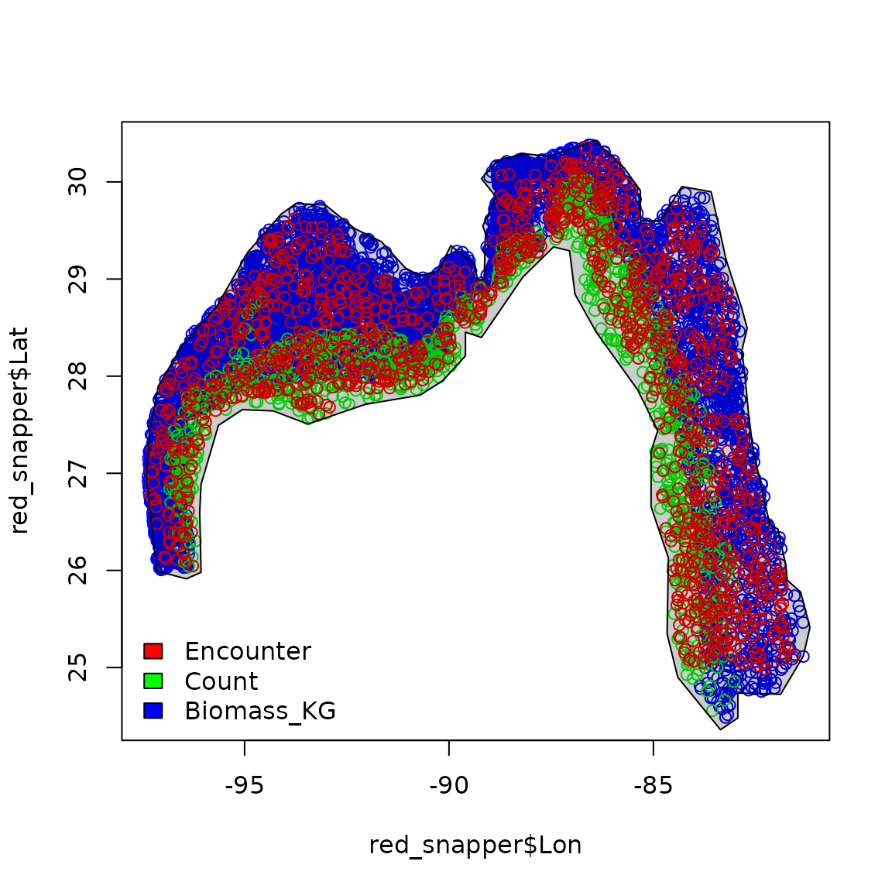
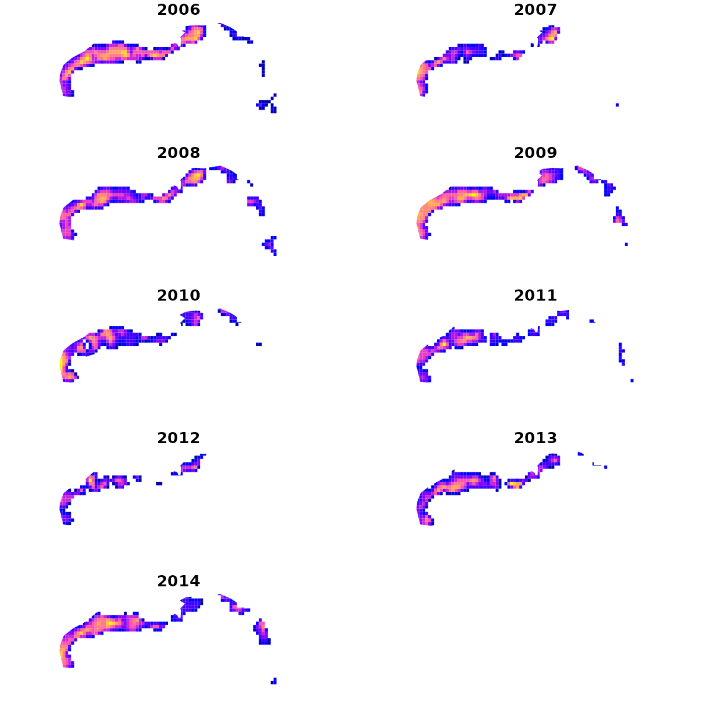
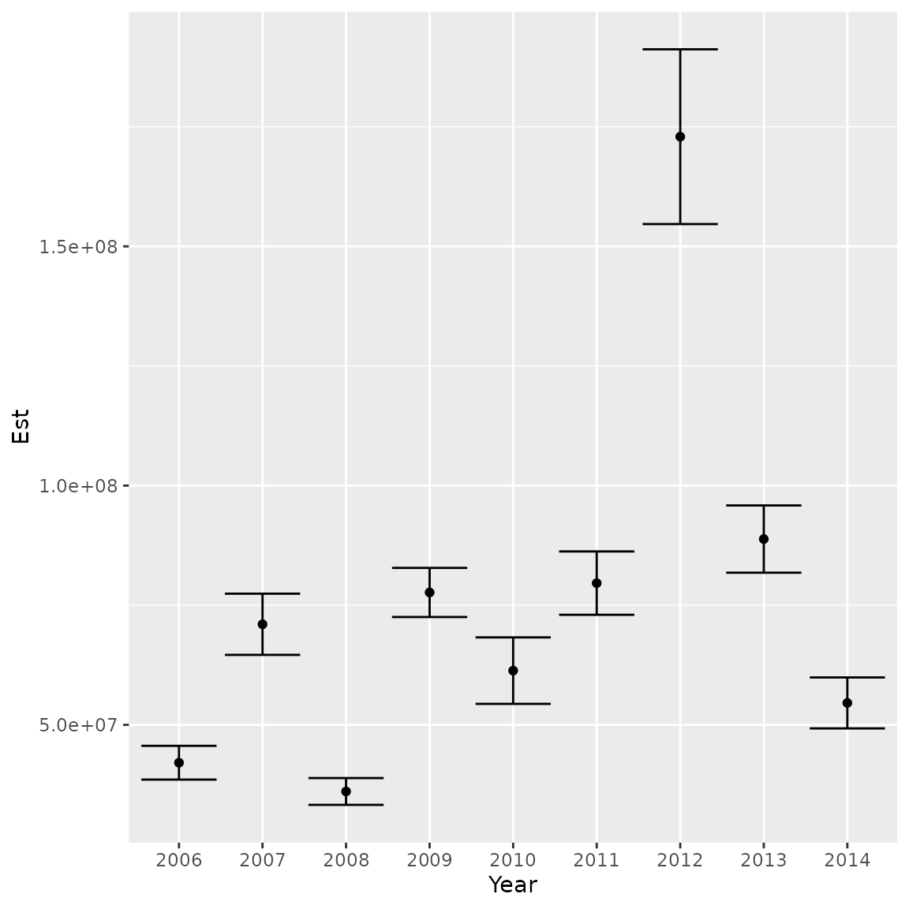

# Multiple data types

``` r
library(tinyVAST)
library(sf)
library(fmesher)
library(ggplot2)
```

`tinyVAST` is an R package for fitting vector autoregressive
spatio-temporal (VAST) models using a minimal and user-friendly
interface. We here show how it can fit a species distribution model
fitted to multiple data types. In this specific case, we fit to
presence/absence, count, and biomass samples for red snapper in the Gulf
of Mexico. However, the interface is quite general and allows combining
a wide range of data types.

``` r
# Load data
data( red_snapper ) 
data( red_snapper_shapefile ) 

# Plot data extent
plot( x = red_snapper$Lon,
        y = red_snapper$Lat,
        col = rainbow(3)[red_snapper$Data_type] )
plot( red_snapper_shapefile, col=rgb(0,0,0,0.2), add=TRUE )
legend( "bottomleft", bty="n", 
        legend=levels(red_snapper$Data_type), 
        fill = rainbow(3) )
```



To fit these data, we first define the `family` for each datum.
Critically, we define the cloglog link for the Presence/Absence data, so
that the linear predictor is proportional to numerical density for each
data type. See (Grüss and Thorson 2019) or (Thorson and Kristensen 2024)
Chap-7 for more details

``` r
# Define link and distribution for each data type
Family = list(
   "Encounter" = binomial(link="cloglog"),
   "Count" = poisson(link="log"),
   "Biomass_KG" = tweedie(link="log")
)

# Relevel gear factor so Biomass_KG is base level
red_snapper$Data_type = relevel( red_snapper$Data_type,
                                 ref = "Biomass_KG" )
```

We then proceed with the other inputs as per usual:

``` r
# Define mesh
mesh = fm_mesh_2d( red_snapper[,c('Lon','Lat')], cutoff = 0.5 )

# define formula with a catchability covariate for gear
formula = Response_variable ~ Data_type + factor(Year) + offset(log(AreaSwept_km2))

# make variable column
red_snapper$var = "logdens"

# fit using tinyVAST
fit = tinyVAST( data = red_snapper, 
                formula = formula,
                space_term = "logdens <-> logdens, sd_space",
                spacetime_term = "logdens <-> logdens, 0, sd_spacetime",
                space_columns = c("Lon",'Lat'),
                spatial_domain = mesh,
                time_column = "Year",
                distribution_column = "Data_type",
                family = Family,
                variable_column = "var" )
```

We then plot density estimates for each year:

``` r
# make extrapolation-grid
sf_grid = st_make_grid( red_snapper_shapefile, cellsize=c(0.2,0.2) )
sf_grid = st_intersection( sf_grid, red_snapper_shapefile )
sf_grid = st_make_valid( sf_grid )

# Extract coordinates for grid
grid_coords = st_coordinates( st_centroid(sf_grid) )
areas_km2 = st_area( sf_grid ) / 1e6

# Calcualte log-density for each year and grid-cell
index = plot_grid = NULL
for( year in sort(unique(red_snapper$Year)) ){
  # compile predictive data frame
  newdata = data.frame( "Lat" = grid_coords[,'Y'], 
                        "Lon" = grid_coords[,'X'],
                        "Year" = year,
                        "Data_type" = "Biomass_KG",
                        "AreaSwept_km2" = mean(red_snapper$AreaSwept_km2),
                        "var" = "logdens" )
  
  # predict
  log_dens = predict( fit, 
                      newdata = newdata, 
                      what = "p_g")
  log_dens = ifelse( log_dens < max(log_dens-log(100)), NA, log_dens )

  # Compile densities
  plot_grid = cbind( plot_grid, log_dens )

  # Estimate and compile total
  total = integrate_output( fit, 
                            newdata = newdata,
                            area = areas_km2 )
  index = cbind( index, total[c('Est. (bias.correct)','Std. Error')] )
  
}
colnames(plot_grid) = colnames(index) = sort(unique(red_snapper$Year))
```

We then plot densities in each year

``` r
# Convert to sf and plot
plot_grid = st_sf( sf_grid, 
                   plot_grid )
plot( plot_grid,
      border = NA )
```



Similarly, we can plot the abundance index and standard errors

``` r
ggplot( data.frame("Year"=colnames(index),"Est"=index[1,],"SE"=index[2,]) ) + 
  geom_point( aes(x=Year, y=Est)) + 
  geom_errorbar( aes(x=Year, ymin=Est-SE, ymax=Est+SE) )
```



Runtime for this vignette: 1.31 mins

## Works cited

Grüss, Arnaud, and James T. Thorson. 2019. “Developing Spatio-Temporal
Models Using Multiple Data Types for Evaluating Population Trends and
Habitat Usage.” *ICES Journal of Marine Science* 76 (6): 1748–61.
<https://doi.org/10.1093/icesjms/fsz075>.

Thorson, James, and Kasper Kristensen. 2024. *Spatio-Temporal Models for
Ecologists*. 1st edition. Boca Raton, FL: Chapman; Hall/CRC.
