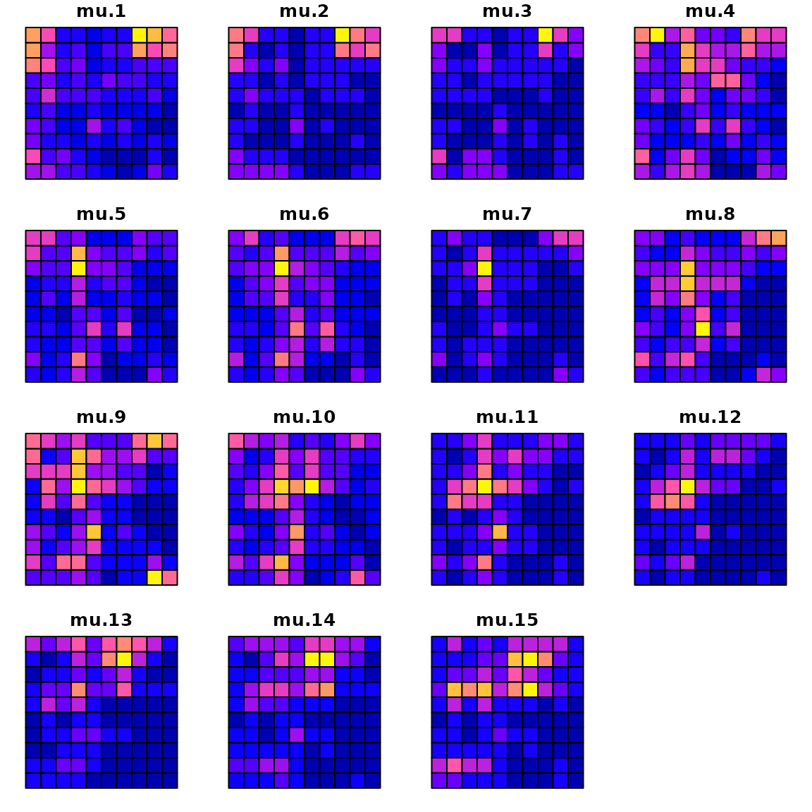
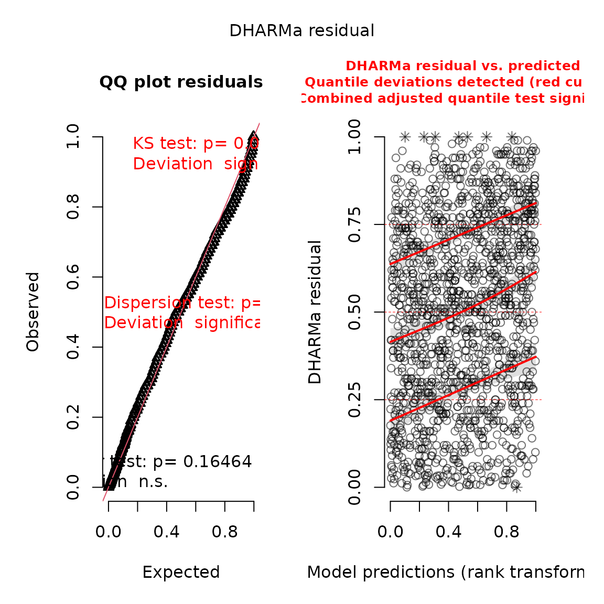
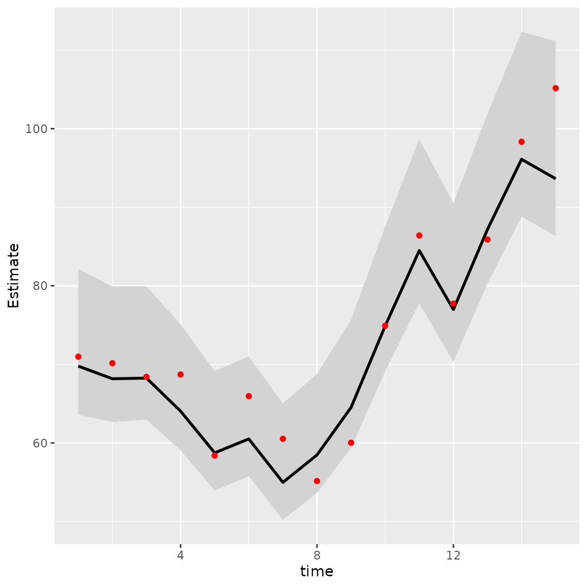
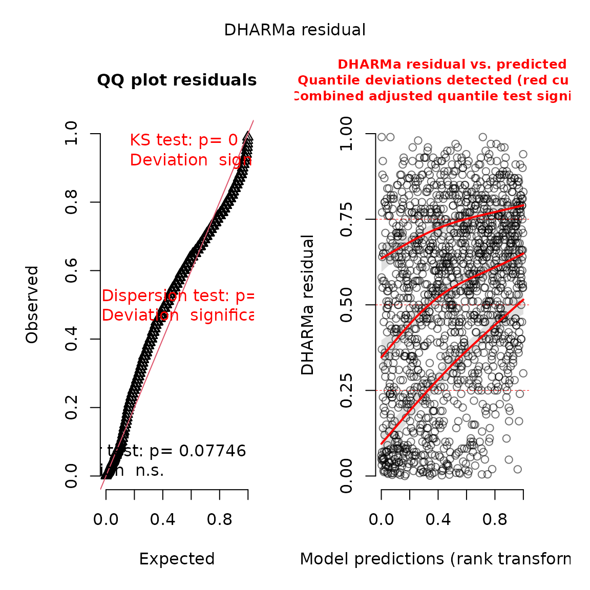
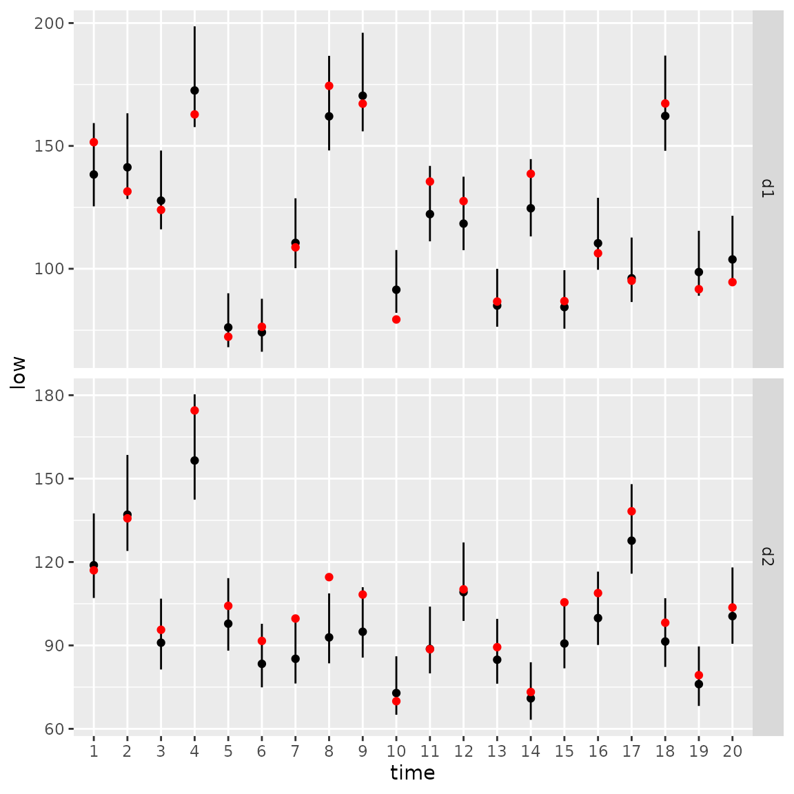

# Vector autoregressive spatio-temporal models

``` r

library(tinyVAST)
library(fmesher)
set.seed(101)
options("tinyVAST.verbose" = FALSE)
```

`tinyVAST` is an R package for fitting vector autoregressive
spatio-temporal (VAST) models. We here explore the capacity to specify
the vector-autoregressive spatio-temporal component.

## Univariate spatio-temporal autoregressive model

We first explore the ability to specify a first-order autoregressive
spatio-temporal process, i.e., a spatial Gompertz model (Thorson et al.
2014).

### Simulate univariate autoregressive process

To do so, we simulate the process:

``` r

# Simulate settings
theta_xy = 0.4
n_x = n_y = 10
n_t = 15
rho = 0.8
spacetime_sd = 0.5
space_sd = 0.5
gamma = 0

# Simulate GMRFs
R_s = exp(-theta_xy * abs(outer(1:n_x, 1:n_y, FUN="-")) )
R_ss = kronecker(R_s, R_s)
Vspacetime_ss = spacetime_sd^2 * R_ss 
Vspace_ss = space_sd^2 * R_ss

# make spacetime AR1 over time
eps_ts = mvtnorm::rmvnorm( n_t, sigma=Vspacetime_ss )
for( t in seq_len(n_t) ){
  if(t>1) eps_ts[t,] = rho*eps_ts[t-1,] + eps_ts[t,]/(1 + rho^2)
}

# make space term
omega_s = mvtnorm::rmvnorm( 1, sigma=Vspace_ss )[1,]

# linear predictor
p_ts = gamma + outer( rep(1,n_t),omega_s ) + eps_ts

# Shape into longform data-frame and add error
Data = data.frame( expand.grid(time=1:n_t, x=1:n_x, y=1:n_y), 
                   var = "logn", 
                   mu = exp(as.vector(p_ts)) )
Data$n = tweedie::rtweedie( n=nrow(Data), mu=Data$mu, phi=0.5, power=1.5 )
mean(Data$n==0)
#> [1] 0.072
```

### Fit univariate spatio-temporal model

We then specify and fit the same model

``` r

# make mesh
mesh = fm_mesh_2d( Data[,c('x','y')] )

# Spatial variable
space_term = "
  logn <-> logn, sd_space
"

# AR1 spatio-temporal variable
spacetime_term = "
  logn -> logn, 1, rho
  logn <-> logn, 0, sd_spacetime
"

# fit model
mytinyVAST = tinyVAST( 
           space_term = space_term,
           spacetime_term = spacetime_term,
           data = Data,
           formula = n ~ 1,
           spatial_domain = mesh,
           family = tweedie() )
mytinyVAST
#> Call: 
#> tinyVAST(formula = n ~ 1, data = Data, space_term = space_term, 
#>     spacetime_term = spacetime_term, family = tweedie(), spatial_domain = mesh)
#> 
#> Run time: 
#> Time difference of 16.4161 secs
#> 
#> Family: 
#> $obs
#> 
#> Family: tweedie 
#> Link function: log 
#> 
#> 
#> 
#> 
#> sdreport(.) result
#>              Estimate Std. Error
#> alpha_j   -0.51042311 0.20682192
#> beta_z     0.84975372 0.07526572
#> beta_z    -0.25841774 0.03730119
#> theta_z    0.44410419 0.06898295
#> log_sigma -0.64811502 0.05006806
#> log_sigma  0.01446398 0.06494080
#> log_kappa -0.15608153 0.16446880
#> Maximum gradient component: 0.005583757 
#> 
#> Proportion conditional deviance explained: 
#> [1] 0.4812371
#> 
#> space_term: 
#>   heads   to from parameter start  Estimate  Std_Error  z_value      p_value
#> 1     2 logn logn         1  <NA> 0.4441042 0.06898295 6.437884 1.211509e-10
#> 
#> spacetime_term: 
#>   heads   to from parameter start lag   Estimate  Std_Error   z_value
#> 1     1 logn logn         1  <NA>   1  0.8497537 0.07526572 11.290049
#> 2     2 logn logn         2  <NA>   0 -0.2584177 0.03730119 -6.927869
#>        p_value
#> 1 1.469547e-29
#> 2 4.272276e-12
#> 
#> Fixed terms: 
#>               Estimate Std_Error   z_value    p_value
#> (Intercept) -0.5104231 0.2068219 -2.467935 0.01358949
```

The estimated values for `beta_z` then correspond to the simulated value
for `rho` and `spatial_sd`.

We can compare the true densities:

``` r

library(sf)
#> Warning: package 'sf' was built under R version 4.5.2
data_wide = reshape( Data[,c('x','y','time','mu')],
                     direction = "wide", idvar = c('x','y'), timevar = "time")
sf_data = st_as_sf( data_wide, coords=c("x","y"))
sf_grid = sf::st_make_grid( sf_data )
sf_plot = st_sf(sf_grid, st_drop_geometry(sf_data) )
plot(sf_plot, max.plot=n_t )
```



with the estimated densities:

``` r

Data$mu_hat = predict(mytinyVAST)
data_wide = reshape( Data[,c('x','y','time','mu_hat')],
                     direction = "wide", idvar = c('x','y'), timevar = "time")
sf_data = st_as_sf( data_wide, coords=c("x","y"))
sf_plot = st_sf(sf_grid, st_drop_geometry(sf_data) )
plot(sf_plot, max.plot=n_t )
```


where a scatterplot shows that they are highly correlated:

``` r

plot( x=Data$mu, y=Data$mu_hat )
```


We can also use the `DHARMa` package to visualize simulation residuals:

``` r

# simulate new data conditional on fixed effects
# and sampling random effects from their predictive distribution
y_ir = simulate(mytinyVAST, nsim=100, type="mle-mvn")

#
res = DHARMa::createDHARMa( simulatedResponse = y_ir, 
                            observedResponse = Data$n, 
                            fittedPredictedResponse = fitted(mytinyVAST) )
plot(res)
```



We can then calculate the area-weighted total abundance and compare it
with its true value:

``` r

# Predicted sample-weighted total
(Est = sapply( seq_len(n_t),
   FUN=\(t) integrate_output(mytinyVAST, newdata=subset(Data,time==t)) ))
#>                          [,1]      [,2]     [,3]      [,4]      [,5]      [,6]
#> Estimate            69.774342 68.167115 68.24959 64.038611 58.736780 60.506542
#> Std. Error           4.733476  4.404922  4.32475  4.092695  3.880481  3.887897
#> Est. (bias.correct) 72.867322 71.288122 71.44284 67.062705 61.536991 63.391199
#> Std. (bias.correct)        NA        NA       NA        NA        NA        NA
#>                          [,7]      [,8]      [,9]     [,10]     [,11]     [,12]
#> Estimate            54.977480 58.463756 64.523920 74.895696 84.490757 76.981720
#> Std. Error           3.772127  3.863062  4.166782  4.702731  5.335555  5.141678
#> Est. (bias.correct) 57.610639 61.214950 67.544399 78.336996 88.253689 80.405085
#> Std. (bias.correct)        NA        NA        NA        NA        NA        NA
#>                         [,13]      [,14]     [,15]
#> Estimate            87.189025  96.106379 93.626461
#> Std. Error           5.514166   6.001112  6.338951
#> Est. (bias.correct) 91.106042 100.570708 98.734105
#> Std. (bias.correct)        NA         NA        NA

# True (latent) sample-weighted total
(True = tapply( Data$mu, INDEX=Data$time, FUN=sum ))
#>         1         2         3         4         5         6         7         8 
#>  70.98033  70.14925  68.40932  68.70763  58.38332  65.95801  60.52297  55.14115 
#>         9        10        11        12        13        14        15 
#>  60.02083  74.91768  86.40811  77.73359  85.88998  98.33442 105.16020

#
Index = data.frame( time=seq_len(n_t), t(Est), True )
Index$low = Index[,'Est...bias.correct.'] - 1.96*Index[,'Std..Error']
Index$high = Index[,'Est...bias.correct.'] + 1.96*Index[,'Std..Error']

#
library(ggplot2)
ggplot(Index, aes(time, Estimate)) +
  geom_ribbon(aes(ymin = low,
                  ymax = high),    # shadowing cnf intervals
              fill = "lightgrey") +
  geom_line( color = "black",
            linewidth = 1) +
  geom_point( aes(time, True), color = "red" )
```



### Comparison with VAST or sdmTMB

Next, we compare this against the current version of VAST (Thorson and
Barnett 2017)

    #> Warning: package 'TMB' was built under R version 4.5.2
    #> Warning: package 'units' was built under R version 4.5.2
    #> Warning: package 'marginaleffects' was built under R version 4.5.2

``` r

settings = make_settings( purpose="index3",
                          n_x = n_x*n_y,
                          Region = "Other",
                          bias.correct = FALSE,
                          use_anisotropy = FALSE )
settings$FieldConfig['Epsilon','Component_1'] = 0
settings$FieldConfig['Omega','Component_1'] = 0
settings$RhoConfig['Epsilon2'] = 4
settings$RhoConfig[c('Beta1','Beta2')] = 3
settings$ObsModel = c(10,2)

# Run VAST
myVAST = fit_model( settings=settings,
                 Lat_i = Data[,'y'],
                 Lon_i = Data[,'x'],
                 t_i = Data[,'time'],
                 b_i = Data[,'n'],
                 a_i = rep(1,nrow(Data)),
                 observations_LL = cbind(Lat=Data[,'y'],Lon=Data[,'x']),
                 grid_dim_km = c(100,100),
                 newtonsteps = 0,
                 loopnum = 1,
                 control = list(eval.max = 10000, iter.max = 10000, trace = 0) )
```

``` r

myVAST
#> fit_model(.) result
#> $par
#>       beta1_ft       beta2_ft     L_omega2_z   L_epsilon2_z      logkappa2 
#>    -0.59988031     0.09993533     0.55005057     0.26695392    -4.68896241 
#> Epsilon_rho2_f      logSigmaM 
#>     0.89582684     0.05547658 
#> 
#> $objective
#> [1] 1256.257
#> 
#> $iterations
#> [1] 3
#> 
#> $evaluations
#> function gradient 
#>        7        3 
#> 
#> $time_for_MLE
#> Time difference of 1.521775 secs
#> 
#> $max_gradient
#> [1] 0.0007302142
#> 
#> $Convergence_check
#> [1] "The model is likely not converged"
#> 
#> $number_of_coefficients
#>  Total  Fixed Random 
#>   2183      7   2176 
#> 
#> $AIC
#> [1] 2526.515
#> 
#> $diagnostics
#>                         Param starting_value     Lower         MLE     Upper
#> beta1_ft             beta1_ft    -0.59987818      -Inf -0.59988031       Inf
#> beta2_ft             beta2_ft     0.09993558      -Inf  0.09993533       Inf
#> L_omega2_z         L_omega2_z     0.55005171      -Inf  0.55005057       Inf
#> L_epsilon2_z     L_epsilon2_z     0.26695303      -Inf  0.26695392       Inf
#> logkappa2           logkappa2    -4.68896169 -6.214608 -4.68896241 -3.565449
#> Epsilon_rho2_f Epsilon_rho2_f     0.89582671 -0.990000  0.89582684  0.990000
#> logSigmaM           logSigmaM     0.05547811      -Inf  0.05547658 10.000000
#>                final_gradient
#> beta1_ft         7.302142e-04
#> beta2_ft         3.958089e-05
#> L_omega2_z       1.120538e-04
#> L_epsilon2_z    -1.264341e-04
#> logkappa2        9.682295e-05
#> Epsilon_rho2_f  -1.139072e-04
#> logSigmaM       -2.508962e-04
#> 
#> $SD
#> sdreport(.) result
#>                   Estimate Std. Error
#> beta1_ft       -0.59988031 0.04573745
#> beta2_ft        0.09993533 0.21591340
#> L_omega2_z      0.55005057 0.08905102
#> L_epsilon2_z    0.26695392 0.04043402
#> logkappa2      -4.68896241 0.18202530
#> Epsilon_rho2_f  0.89582684 0.06297620
#> logSigmaM       0.05547658 0.06294172
#> Maximum gradient component: 0.0007302142 
#> 
#> $time_for_sdreport
#> Time difference of 4.742581 secs
#> 
#> $time_for_run
#> Time difference of 23.95087 secs
```

Or with sdmTMB (Anderson et al., n.d.)

``` r

library(sdmTMB)
sdmTMB_mesh = make_mesh(Data, c("x","y"), n_knots=n_x*n_y )

start_time2 = Sys.time()
mysdmTMB = sdmTMB(
  formula = n ~ 1,
  data = Data,
  mesh = sdmTMB_mesh,
  spatial = "on",
  spatiotemporal = "ar1",
  time = "time",
  family = tweedie()
)
#> Warning: the 'findbars' function has moved to the reformulas package. Please update your imports, or ask an upstream package maintainter to do so.
#> This warning is displayed once per session.
#> Warning: the 'nobars' function has moved to the reformulas package. Please update your imports, or ask an upstream package maintainter to do so.
#> This warning is displayed once per session.
sdmTMBtime = Sys.time() - start_time2
```

The models all have similar runtimes

``` r

Times = c( "tinyVAST" = mytinyVAST$run_time,
           "VAST" = myVAST$total_time,
           "sdmTMB" = sdmTMBtime )
knitr::kable( cbind("run times (sec.)"=Times), digits=1)
```

|          | run times (sec.) |
|:---------|-----------------:|
| tinyVAST |             16.4 |
| VAST     |             27.2 |
| sdmTMB   |             28.8 |

### Delta models

We can also fit this univariate spatio-temporal process using a
Poisson-linked gamma delta model (Thorson 2018)

``` r

# fit model
mydelta2 = tinyVAST( 
  data = Data,
  formula = n ~ 1,
  delta_options = list(
    formula = ~ 0 + factor(time),
    spacetime_term = "logn -> logn, 1, rho"),
  family = delta_lognormal(type="poisson-link"),
  spatial_domain = mesh 
)

mydelta2
#> Call: 
#> tinyVAST(formula = n ~ 1, data = Data, family = delta_lognormal(type = "poisson-link"), 
#>     delta_options = list(formula = ~0 + factor(time), spacetime_term = "logn -> logn, 1, rho"), 
#>     spatial_domain = mesh)
#> 
#> Run time: 
#> Time difference of 16.30274 secs
#> 
#> Family: 
#> $obs
#> 
#> Family: binomial lognormal 
#> Link function: log log 
#> 
#> 
#> 
#> 
#> sdreport(.) result
#>              Estimate Std. Error
#> alpha_j    0.96740001 0.03523113
#> alpha2_j  -1.24655464 0.14981014
#> alpha2_j  -1.29278791 0.17500129
#> alpha2_j  -1.30567555 0.19172149
#> alpha2_j  -1.32180772 0.20304204
#> alpha2_j  -1.57098809 0.21258829
#> alpha2_j  -1.44507841 0.21944963
#> alpha2_j  -1.71680202 0.22626333
#> alpha2_j  -1.54485935 0.23247418
#> alpha2_j  -1.39904963 0.23307994
#> alpha2_j  -1.12515799 0.23638030
#> alpha2_j  -1.22354407 0.23877401
#> alpha2_j  -1.51311725 0.24006133
#> alpha2_j  -1.24691178 0.24216425
#> alpha2_j  -1.12785624 0.24209137
#> alpha2_j  -1.07071406 0.24334579
#> beta2_z    0.89674417 0.03512480
#> beta2_z    0.31332882 0.03906491
#> log_sigma  0.02962681 0.02475180
#> log_kappa  0.10856725 0.14818594
#> Maximum gradient component: 0.002531402 
#> 
#> Proportion conditional deviance explained: 
#> [1] 0.3295016
#> 
#> Fixed terms: 
#>             Estimate  Std_Error  z_value       p_value
#> (Intercept)   0.9674 0.03523113 27.45867 5.474654e-166
```

And we can again use the `DHARMa` package (Hartig 2017) to visualize
conditional simulation quantile (a.k.a. Dunn-Smythe) residuals (Dunn and
Smyth 1996):

``` r

# simulate new data conditional on fixed effects
# and sampling random effects from their predictive distribution
y_ir = simulate(mydelta2, nsim=100, type="mle-mvn")

# Visualize using DHARMa
res = DHARMa::createDHARMa( simulatedResponse = y_ir, 
                            observedResponse = Data$n, 
                            fittedPredictedResponse = fitted(mydelta2) )
plot(res)
```



We can then use marginal and conditional AIC to compare the fit of the
delta-model and Tweedie distribution:

``` r

# AIC table
AIC_table = cbind(
  mAIC = c( "Tweedie" = AIC(mytinyVAST), 
            "delta-lognormal" = AIC(mydelta2) ), 
  cAIC = c( "Tweedie" = tinyVAST::cAIC(mytinyVAST), 
            "delta-lognormal" = tinyVAST::cAIC(mydelta2) ) 
)

# Print table
knitr::kable( 
  AIC_table,
  digits=3
)
```

|                 |     mAIC |     cAIC |
|:----------------|---------:|---------:|
| Tweedie         | 2501.480 | 2356.788 |
| delta-lognormal | 2947.194 | 2848.163 |

## Bivariate vector autoregressive spatio-temporal model

We next highlight how to specify a bivariate spatio-temporal model with
a cross-laggged (vector autoregressive) interaction Thorson et al.
(2019). \## Simulate bivariate model

We first simulate artificial data for the sake of demonstration:

``` r

# Simulate settings
theta_xy = 0.2
n_x = n_y = 10
n_t = 20
B = rbind( c( 0.5, -0.25),
           c(-0.1,  0.50) )

# Simulate GMRFs
R = exp(-theta_xy * abs(outer(1:n_x, 1:n_y, FUN="-")) )
d1 = mvtnorm::rmvnorm(n_t, sigma=0.2*kronecker(R,R) )
d2 = mvtnorm::rmvnorm(n_t, sigma=0.2*kronecker(R,R) )
d = abind::abind( d1, d2, along=3 )

# Project through time and add mean
for( t in seq_len(n_t) ){
  if(t>1) d[t,,] = t(B%*%t(d[t-1,,])) + d[t,,]
}

# Shape into longform data-frame and add error
Data = data.frame( expand.grid(time=1:n_t, x=1:n_x, y=1:n_y, "var"=c("d1","d2")),
                   mu = exp(as.vector(d)))
Data$n = tweedie::rtweedie( n=nrow(Data), mu=Data$mu, phi=0.5, power=1.5 )
```

### Fit bivariate model

We next set up inputs and run the model:

``` r

# make mesh
mesh = fm_mesh_2d( Data[,c('x','y')] )

# Define DSEM
dsem = "
  d1 -> d1, 1, b11
  d2 -> d2, 1, b22
  d2 -> d1, 1, b21
  d1 -> d2, 1, b12
  d1 <-> d1, 0, var1
  d2 <-> d2, 0, var1
"

# fit model
out = tinyVAST( spacetime_term = dsem,
           data = Data,
           formula = n ~ 0 + var,
           spatial_domain = mesh,
           family = tweedie() )
out
#> Call: 
#> tinyVAST(formula = n ~ 0 + var, data = Data, spacetime_term = dsem, 
#>     family = tweedie(), spatial_domain = mesh)
#> 
#> Run time: 
#> Time difference of 1.340818 mins
#> 
#> Family: 
#> $obs
#> 
#> Family: tweedie 
#> Link function: log 
#> 
#> 
#> 
#> 
#> sdreport(.) result
#>               Estimate Std. Error
#> alpha_j    0.264368407 0.09266171
#> alpha_j    0.035863837 0.07360860
#> beta_z     0.455447933 0.06734774
#> beta_z     0.389078116 0.08038421
#> beta_z    -0.405603381 0.08530597
#> beta_z    -0.084083295 0.06545855
#> beta_z     0.329048842 0.01844056
#> log_sigma -0.691801474 0.02886804
#> log_sigma  0.007588816 0.05777685
#> log_kappa -0.487467947 0.09474226
#> Maximum gradient component: 0.003830999 
#> 
#> Proportion conditional deviance explained: 
#> [1] 0.4461972
#> 
#> spacetime_term: 
#>   heads to from parameter start lag    Estimate  Std_Error   z_value
#> 1     1 d1   d1         1  <NA>   1  0.45544793 0.06734774  6.762632
#> 2     1 d2   d2         2  <NA>   1  0.38907812 0.08038421  4.840231
#> 3     1 d1   d2         3  <NA>   1 -0.40560338 0.08530597 -4.754689
#> 4     1 d2   d1         4  <NA>   1 -0.08408329 0.06545855 -1.284527
#> 5     2 d1   d1         5  <NA>   0  0.32904884 0.01844056 17.843757
#> 6     2 d2   d2         5  <NA>   0  0.32904884 0.01844056 17.843757
#>        p_value
#> 1 1.355075e-11
#> 2 1.296885e-06
#> 3 1.987519e-06
#> 4 1.989575e-01
#> 5 3.232145e-71
#> 6 3.232145e-71
#> 
#> Fixed terms: 
#>         Estimate  Std_Error   z_value     p_value
#> vard1 0.26436841 0.09266171 2.8530491 0.004330193
#> vard2 0.03586384 0.07360860 0.4872235 0.626099977
```

The values for `beta_z` again correspond to the specified value for
interaction-matrix `B`

We can again calculate the area-weighted total abundance and compare it
with its true value:

``` r

# Predicted sample-weighted total 
# for each year-variable combination
Est1 = Est2 = NULL
for( t in seq_len(n_t) ){
  Est1 = rbind(Est1, integrate_output( 
    out, 
    newdata = subset(Data, time==t & var=="d1")
  ))
  Est2 = rbind(Est2, integrate_output( 
    out, 
    newdata = subset(Data, time==t & var=="d2")
  ))
}

# True (latent) sample-weighted total
True = tapply( 
  Data$mu, 
  INDEX=list("time"=Data$time,"var"=Data$var), 
  FUN=sum 
)

# Make long-form data frame for ggplot
Index = data.frame( 
  expand.grid(dimnames(True)), 
  True = as.vector(True),
  rbind(Est1, Est2)
)

# Format intervals for ggplot
Index$low = Index[,'Est...bias.correct.'] - 1.96*Index[,'Std..Error']
Index$high = Index[,'Est...bias.correct.'] + 1.96*Index[,'Std..Error']

#
library(ggplot2)
ggplot(Index, aes( time, Estimate )) +
  facet_grid( rows=vars(var), scales="free" ) +
  geom_segment(aes(y = low,
                  yend = high,
                  x = time,
                  xend = time) ) +
  geom_point( aes(x=time, y=Estimate), color = "black") +
  geom_point( aes(x=time, y=True), color = "red" )
```



## Works cited

Anderson, Sean C., Eric J. Ward, Philina A. English, Lewis A. K.
Barnett, and James T. Thorson. n.d. “sdmTMB: An R Package for Fast,
Flexible, and User-Friendly Generalized Linear Mixed Effects Models with
Spatial and Spatiotemporal Random Fields.” *Journal of Open Source
Software*, 2022.03.24.485545.
<https://doi.org/10.1101/2022.03.24.485545>.

Dunn, Peter K., and Gordon K. Smyth. 1996. “Randomized Quantile
Residuals.” *Journal of Computational and Graphical Statistics* 5 (3):
236–44.
<http://www.tandfonline.com/doi/abs/10.1080/10618600.1996.10474708>.

Hartig, Florian. 2017. “DHARMa: Residual Diagnostics for Hierarchical
(Multi-Level/Mixed) Regression Models.” *R Package Version 0.1* 5.

Thorson, James T. 2018. “Three Problems with the Conventional
Delta-Model for Biomass Sampling Data, and a Computationally Efficient
Alternative.” *Canadian Journal of Fisheries and Aquatic Sciences* 75
(9): 1369–82. <https://doi.org/10.1139/cjfas-2017-0266>.

Thorson, James T., Grant Adams, and Kirstin Holsman. 2019.
“Spatio-Temporal Models of Intermediate Complexity for Ecosystem
Assessments: A New Tool for Spatial Fisheries Management.” *Fish and
Fisheries* 20 (6): 1083–99. <https://doi.org/10.1111/faf.12398>.

Thorson, James T., and Lewis A. K. Barnett. 2017. “Comparing Estimates
of Abundance Trends and Distribution Shifts Using Single- and
Multispecies Models of Fishes and Biogenic Habitat.” *ICES Journal of
Marine Science* 74 (5): 1311–21.
<https://doi.org/10.1093/icesjms/fsw193>.

Thorson, James T., Stephan B. Munch, and Douglas P. Swain. 2017.
“Estimating Partial Regulation in Spatiotemporal Models of Community
Dynamics.” *Ecology* 98 (5): 1277–89.
<https://doi.org/10.1002/ecy.1760>.

Thorson, James T., Hans J. Skaug, Kasper Kristensen, et al. 2014. “The
Importance of Spatial Models for Estimating the Strength of Density
Dependence.” *Ecology* 96 (5): 1202–12.
<https://doi.org/10.1890/14-0739.1>.
