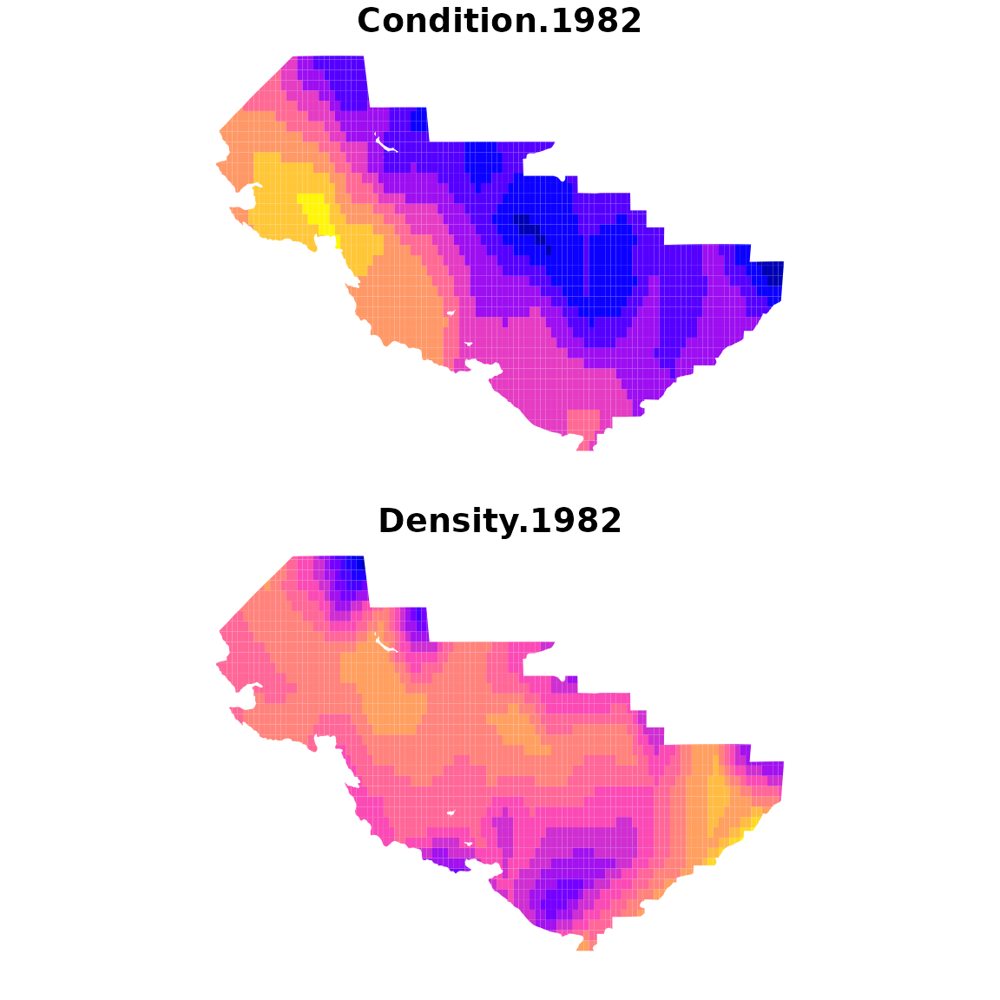
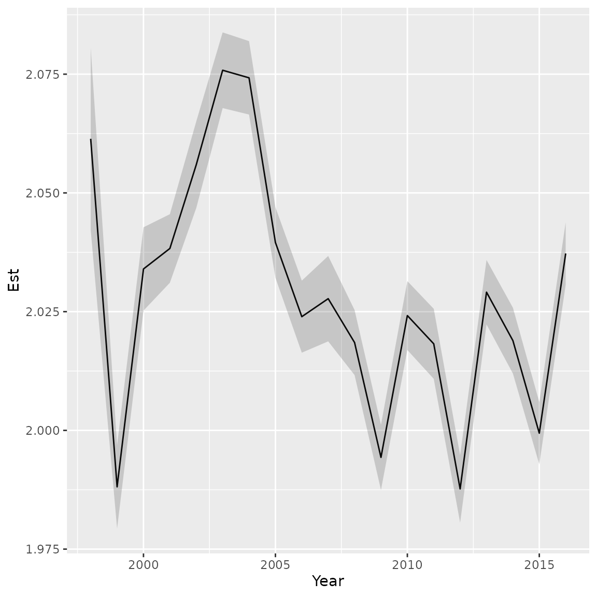

# Condition and density

``` r
library(tinyVAST)
library(fmesher)
library(sf)
library(ggplot2)
```

`tinyVAST` is an R package for fitting vector autoregressive
spatio-temporal (VAST) models using a minimal and user-friendly
interface. We here show how it can fit a bivariate spatio-temporal model
representing density dependence in physiological condition for fishes
(Thorson 2015).  
This replicates a similar vignette provided for the VAST package, but
showcases several improvements in interpretation and interface.

## Data format

We first load and combine the two data sets:

``` r
data( condition_and_density )

# Combine both parts
combo_data = plyr::rbind.fill( condition_and_density$condition, 
                              condition_and_density$density )

# Reformat data in expected format
formed_data = cbind( combo_data[,c("Year","Lat","Lon")],
  "Type" = factor(ifelse( is.na(combo_data[,'Individual_length_cm']), 
                   "Biomass", "Condition" )),
  "Response" = ifelse( is.na(combo_data[,'Individual_length_cm']), 
                        combo_data[,'Sample_biomass_KGperHectare'], 
                        log(combo_data[,'Individual_weight_Grams']) ),
  "log_length" = ifelse( is.na(combo_data[,'Individual_length_cm']), 
                        rep(0,nrow(combo_data)), 
                        log(combo_data[,'Individual_length_cm'] / 10) ))

#
#formed_data$Year_Type = paste0( formed_data$Year, "_", formed_data$Type )
```

We then construct the SPDE mesh

``` r
# make mesh
mesh = fm_mesh_2d( formed_data[,c('Lon','Lat')], cutoff=1 )
```

Next, we specify spatial and spatio-temporal variance in both condition
and density.

``` r
#
sem = "
  Biomass <-> Biomass, sdB
  Condition <-> Condition, sdC
  Biomass -> Condition, dens_dep
"

#
dsem = "
  Biomass <-> Biomass, 0, sdB
  Condition <-> Condition, 0, sdC
  Biomass -> Condition, 0, dens_dep
"
```

Finally, we define the distribution for each data set using the `family`
argument:

``` r
#
Family = list(
  Biomass = tweedie(),
  Condition = gaussian()
)
```

Finally, we fit the model using tinyVAST

``` r
# fit model
fit = tinyVAST( data = formed_data,
           formula = Response ~ interaction(Year,Type) + log_length,
           spatial_domain = mesh,
           control = tinyVASTcontrol( trace=0, verbose=TRUE, profile="alpha_j" ),
           space_term = sem,
           spacetime_term = dsem,
           family = Family,
           variables = c("Biomass","Condition"),
           variable_column = "Type",
           space_columns = c("Lon", "Lat"),
           time_column = "Year",
           distribution_column = "Type",
           times = 1982:2016 )
#> Warning: The model may not have converged. Maximum final gradient:
#> 0.0903345129887285.
```

We can look at structural parameters using summary functions:

``` r
# spatial terms
summary(fit, "space_term")
#>   heads        to      from parameter start      Estimate   Std_Error
#> 1     2   Biomass   Biomass         1  <NA>  1.423910e+00 0.133053431
#> 2     2 Condition Condition         2  <NA> -3.316168e-02 0.004167330
#> 3     1 Condition   Biomass         3  <NA>  9.517896e-05 0.004855006
#>       z_value      p_value
#> 1 10.70179410 9.982641e-27
#> 2 -7.95753500 1.755005e-15
#> 3  0.01960429 9.843590e-01

# spatio-temporal terms
summary(fit, "spacetime_term")
#>   heads        to      from parameter start lag     Estimate   Std_Error
#> 1     2   Biomass   Biomass         1  <NA>   0  0.966424911 0.024274646
#> 2     2 Condition Condition         2  <NA>   0 -0.040541857 0.002723367
#> 3     1 Condition   Biomass         3  <NA>   0  0.008199896 0.003339291
#>     z_value      p_value
#> 1  39.81211 0.000000e+00
#> 2 -14.88666 4.023469e-50
#> 3   2.45558 1.406576e-02
```

## Abundance-weighted expansion

To explore output, we can plot output using the survey extent:

``` r
# Extract shapefile
region = condition_and_density$eastern_bering_sea

# make extrapolation-grid
sf_grid = st_make_grid( region, cellsize=c(0.2,0.2) )
sf_grid = st_intersection( sf_grid, region )
sf_grid = st_make_valid( sf_grid )
n_g = length(sf_grid)

#
grid_coords = st_coordinates( st_centroid(sf_grid) )
areas_km2 = st_area( sf_grid ) / 1e6

# Condition in 
newdata = data.frame( "Lat" = grid_coords[,'Y'], 
                      "Lon" = grid_coords[,'X'],
                      "Year" = 1982,
                      "Type" = "Condition",
                      #"Year_Type" = "1982_Condition",
                      "log_length" = 0 )  # Average log-length across years
cond_1982 = predict(fit, newdata=newdata, what="p_g")

# Repeat for density
newdata2 = newdata
newdata2$Type = "Biomass"
#newdata2$Year_Type = "1982_Biomass"
dens_1982 = predict(fit, newdata=newdata2, what="p_g")

# Plot on map
plot_grid = st_sf( sf_grid, 
                    "Condition.1982" = cond_1982,
                    "Density.1982" = dens_1982 )

plot( plot_grid, border=NA )
```



## Density-weighted condition

Finally, we can calculate density-weighted condition, using local
numerical density as weighting term while averaging across the model
domain. Condition will be in units *mass per allometric-length* and the
model is estimating the allometric weight-length relationship jointly
with condition. Therefore, condition will have units that are not
directly comparable with either weight or density.

``` r
# 
expand_data = rbind( newdata2, newdata )

#
cond_tz = data.frame( "Year"=1998:2016, "Est"=NA, "SE"=NA )
for( yearI in seq_len(nrow(cond_tz)) ){
  expand_data[,'Year'] = cond_tz[yearI,"Year"]
  out = integrate_output( fit, 
                          newdata = expand_data,
                          area = c(as.numeric(areas_km2),rep(0,n_g)),
                          type = rep(c(0,3),each=n_g),
                          weighting_index = c( rep(0,n_g), seq_along(areas_km2)-1 ),
                          bias.correct = TRUE ) 
  cond_tz[yearI,c("Est","SE")] = out[c("Estimate","Std. Error")]
}

# plot time-series
ggplot( cond_tz ) +
  geom_line( aes(x=Year, y=Est) ) +
  geom_ribbon( aes(x=Year, ymin=Est-SE, ymax=Est+SE), alpha=0.2 )
```



Runtime for this vignette: 12.62 mins

#### Works cited

Thorson, James T. 2015. “Spatio-Temporal Variation in Fish Condition Is
Not Consistently Explained by Density, Temperature, or Season for
California Current Groundfishes.” *Marine Ecology Progress Series* 526
(April): 101–12. <https://doi.org/10.3354/meps11204>.
