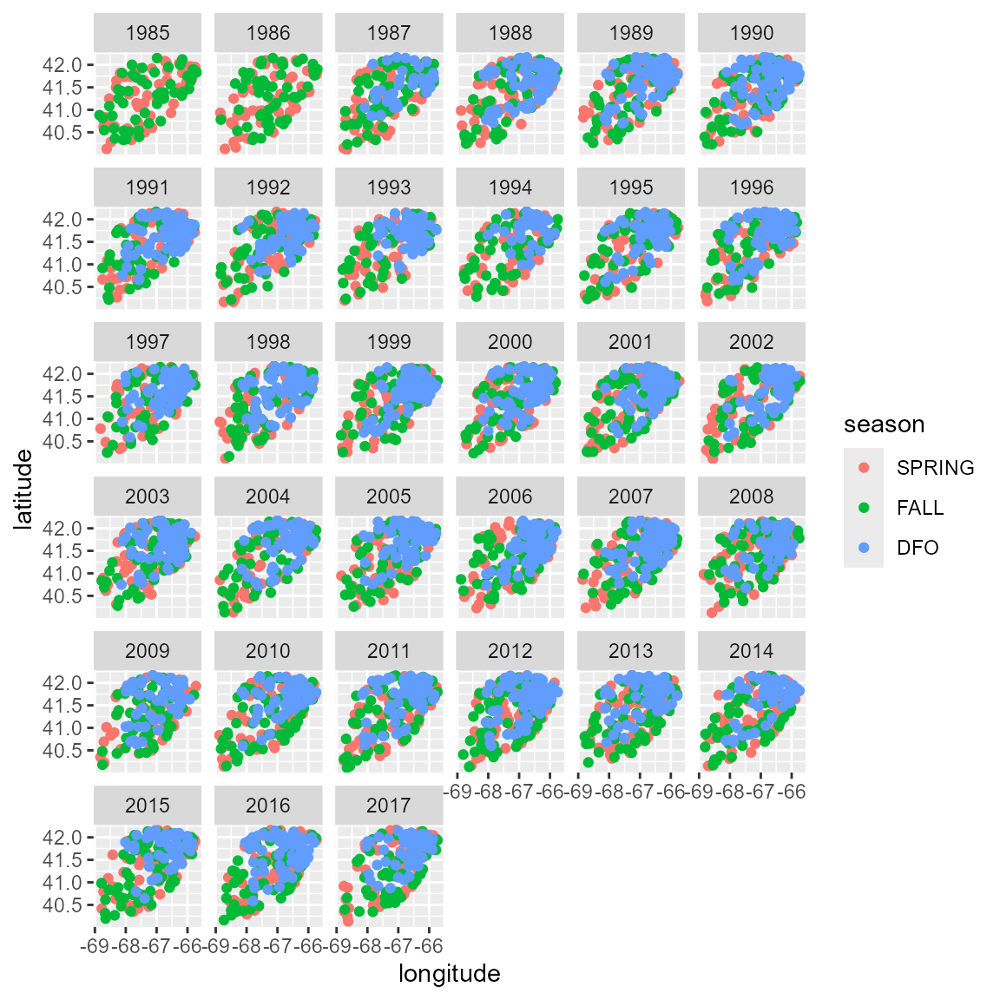
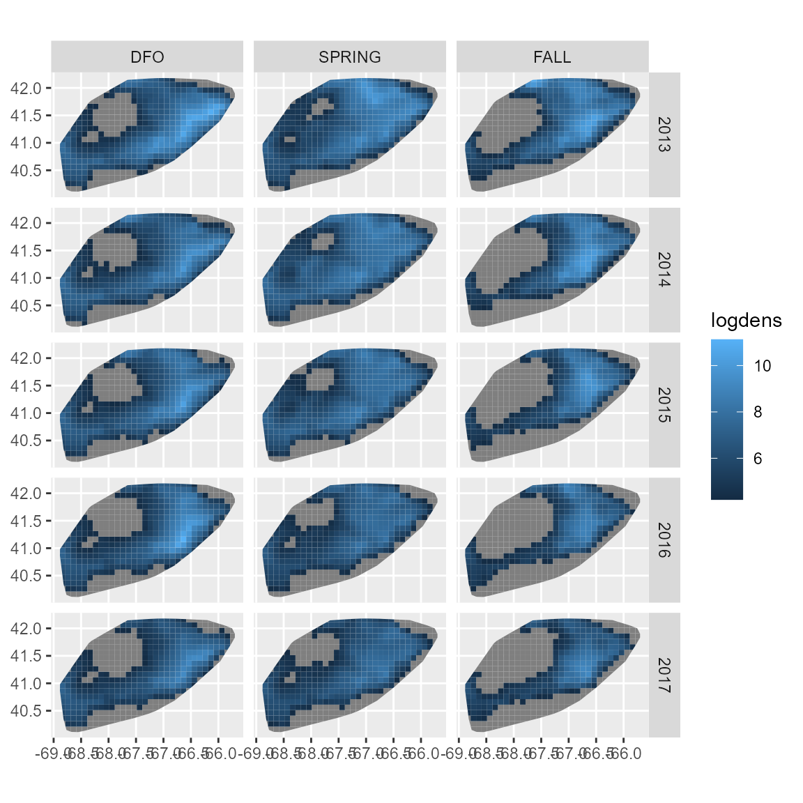
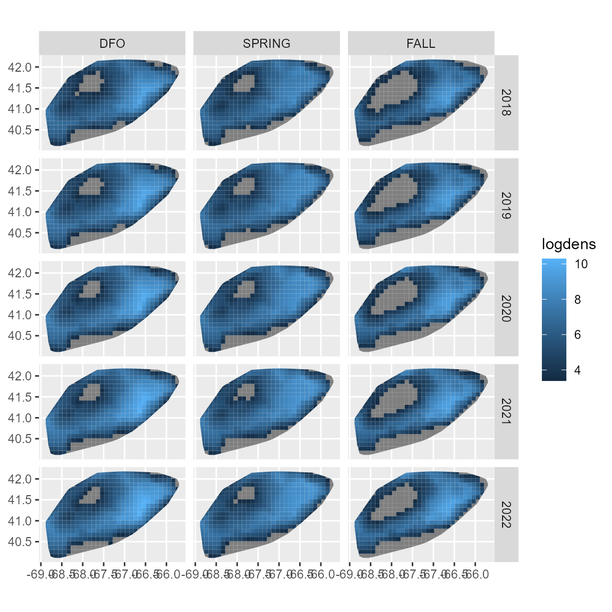
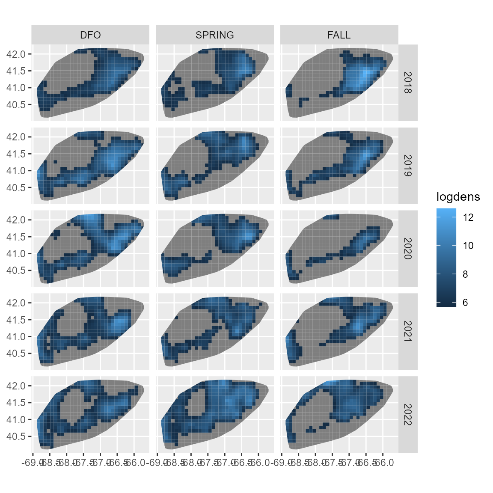

# Seasonal index standardization

``` r

library(tinyVAST)
library(sf)
library(fmesher)
library(ggplot2)
```

`tinyVAST` can estimate seasonal spatio-temporal models using spatially
varying coefficients (Thorson et al. 2023) to incorporate additional
spatial variation by season and then including an autoregressive
spatio-temporal process across season-within-year indices. This was
originally demonstrated using package VAST (Thorson et al. 2020), and we
here show code analyzing spring and fall bottom-trawl surveys for
yellowtail flounder in the Northwest Atlantic conducted by the NEFSC, as
well as a early-spring bottom trawl survey by DFO Canada. Here, we use a
spatio-temporal process with three seasons per year, and estimating a
lag-1 correlation (representing correlations among seasons within year)
and a lag-3 correlation (representing correlations within season among
years).

``` r

# Load data
data( atlantic_yellowtail ) 

# Plot data extent
ggplot( atlantic_yellowtail ) + 
  geom_point( aes(x=longitude, y = latitude, col = season) ) +
  facet_wrap( vars(year) )
```



We then define a new year_season variable

``` r

# Define levels
atlantic_yellowtail$season = 
  factor(atlantic_yellowtail$season, levels = c("DFO", "SPRING", "FALL"))
n_years = max(atlantic_yellowtail$year) - min(atlantic_yellowtail$year) + 1
n_seasons = nlevels(atlantic_yellowtail$season)

# convert to an integer
atlantic_yellowtail$season_year_integer =    
  n_seasons * (atlantic_yellowtail$year - min(atlantic_yellowtail$year)) + 
  as.numeric(atlantic_yellowtail$season) - 1

# log-scale area swept
atlantic_yellowtail$log_swept = log(atlantic_yellowtail$swept)

# Add variable column
atlantic_yellowtail$var = "density"
```

We then define argument `spatial_varying` as a formula containing the
space-season effect, and in this instance it replaces the `space_term`:

``` r

# Define mesh
mesh = fm_mesh_2d( 
  atlantic_yellowtail[,c('longitude','latitude')], 
  cutoff = 0.2 
)

# define formula log-area-swept offset, and different in mean by season
formula = weight ~ season + offset(log_swept)

# Define SVC by season
spatial_varying = ~ season

spacetime_term = "
  density -> density, 1, ar_st_season
  density -> density, 3, ar_st_year
  density <-> density, 0, sd_st
"
time_term = "
  density -> density, 1, ar_t_season
  density -> density, 3, ar_t_year
  density <-> density, 0, sd_t
" 

# fit using tinyVAST
fit = tinyVAST( 
  data = droplevels(atlantic_yellowtail), 
  # Specification
  formula = formula,
  spatial_varying = spatial_varying, 
  spacetime_term = spacetime_term,
  time_term = time_term,
  spatial_domain = mesh,
  family = tweedie("log"),
  # Indexing
  space_columns = c("longitude",'latitude'),
  time_column = "season_year_integer",
  times = seq_len(n_seasons * n_years),
  variable_column = "var",
  # Settings
  control = tinyVASTcontrol(
  #  profile = "alpha_j"
  )
)
```

We can inspect output, and see that both season-within-year (lag-1) and
season-across-year (lag-3) terms are significant:

``` r

summary(fit, "spacetime_term")
#>   heads      to    from parameter start lag  Estimate  Std_Error   z_value
#> 1     1 density density         1  <NA>   1 0.2460266 0.04389254  5.605204
#> 2     1 density density         2  <NA>   3 0.5267717 0.04868399 10.820224
#> 3     2 density density         3  <NA>   0 1.3015135 0.05159718 25.224508
#>         p_value
#> 1  2.080103e-08
#> 2  2.761009e-27
#> 3 2.157267e-140
```

We can then visualize density in selected years. To do this, we first
define a predictive grid

``` r

# get sf for sampling points
sf_locs = st_as_sf(
  atlantic_yellowtail,
  coords = c("longitude","latitude")
)
sf_locs = st_sf(
  sf_locs,
  crs = st_crs("EPSG:4326")
)

# make convex hull for domain 
sf_domain = st_convex_hull(
  st_union(sf_locs)
)

# Make grid in domain
sf_grid = st_make_grid(
  sf_domain,
  cellsize = c(0.1,0.1)
)
sf_grid = st_intersection(
  sf_grid, sf_domain
)

# Data frame for prediction
grid_coords = st_coordinates(st_centroid(sf_grid))
grid_coords = cbind( 
  sf_grid,
  setNames( data.frame(grid_coords), c("longitude","latitude")), 
  swept = as.numeric(st_area(sf_grid)) / 1e6,
  grid = seq_len(length(sf_grid)) 
)
```

We then select a set of years and seasons, predict those values, and
then plot them

``` r

# season_year
newdata = expand.grid(
  season = levels(atlantic_yellowtail$season),
  year = 2013:2017,
  grid = seq_len(length(sf_grid))
)

#
newdata = merge( newdata, grid_coords )
newdata$log_swept = log(newdata$swept)

# Define levels
newdata$season = 
  factor(newdata$season, levels = c("DFO", "SPRING", "FALL"))

# convert to an integer
newdata$season_year_integer =   
  n_seasons * (newdata$year - min(atlantic_yellowtail$year)) + 
  as.numeric(newdata$season) - 1

# Predict
newdata$logdens = predict(
  fit,
  newdata = newdata,
  what = "p_g"
)

# Censor low densities to show high densities better
newdata$logdens = ifelse(
  newdata$logdens < (max(newdata$logdens) - log(1000) ),
  NA,
  newdata$logdens
)

ggplot(newdata) +
  geom_sf( aes(fill = logdens, geometry = geometry), col = NA ) +
  facet_grid( rows = vars(year), cols = vars(season) )
```



We can also project the model. To do so, we first rebuild the `newdata`
argument for the projection period (which would involve forecasted
covariates if we were including any) while selecting the forecast
interval:

``` r

# season_year
projdata = expand.grid(
  season = levels(atlantic_yellowtail$season),
  year = 2018:2022,
  grid = seq_len(length(sf_grid))
)

#
projdata = merge( projdata, grid_coords )
projdata$log_swept = log( projdata$swept )

# Define levels
projdata$season = 
  factor(projdata$season, levels = c("DFO", "SPRING", "FALL"))

# convert to an integer
projdata$season_year_integer = 
  n_seasons * (projdata$year - min(atlantic_yellowtail$year)) + 
  as.numeric(projdata$season) - 1
```

we then use the `project` function, and show a deterministic projection:

``` r

#
projdata$logdens = project( 
  object = fit,
  extra_times = (n_seasons * n_years) + 1:24,
  newdata = projdata,
  what = "p_g",
  future_var = FALSE,
  past_var = FALSE,
  parm_var = FALSE
)

# Censor low densities to show high densities better
projdata$logdens = ifelse(
  projdata$logdens < (max(projdata$logdens) - log(1000) ),
  NA,
  projdata$logdens
)

ggplot(projdata) +
  geom_sf( aes(fill = logdens, geometry = geometry), col = NA ) +
  facet_grid( rows = vars(year), cols = vars(season) )
```



We then show a single draw from the stochastic projection

``` r

# Set seed for reproducibility
set.seed(123)

#
projdata$logdens = project( 
  object = fit,
  extra_times = (n_seasons * n_years) + 1:24,
  newdata = projdata,
  what = "p_g",
  future_var = TRUE,
  past_var = FALSE,
  parm_var = FALSE
)

# Censor low densities to show high densities better
projdata$logdens = ifelse(
  projdata$logdens < (max(projdata$logdens) - log(1000) ),
  NA,
  projdata$logdens
)

ggplot(projdata) +
  geom_sf( aes(fill = logdens, geometry = geometry), col = NA ) +
  facet_grid( rows = vars(year), cols = vars(season) )
```



Runtime for this vignette: 13.02 mins

## Works cited

Thorson, James T, Charles F Adams, Elizabeth N Brooks, et al. 2020.
“Seasonal and Interannual Variation in Spatio-Temporal Models for Index
Standardization and Phenology Studies.” *ICES Journal of Marine Science*
77 (5): 1879–92. <https://doi.org/10.1093/icesjms/fsaa074>.

Thorson, James T., Cheryl L. Barnes, Sarah T. Friedman, Janelle L.
Morano, and Margaret C. Siple. 2023. “Spatially Varying Coefficients Can
Improve Parsimony and Descriptive Power for Species Distribution
Models.” *Ecography* 2023 (5): e06510.
<https://doi.org/10.1111/ecog.06510>.
