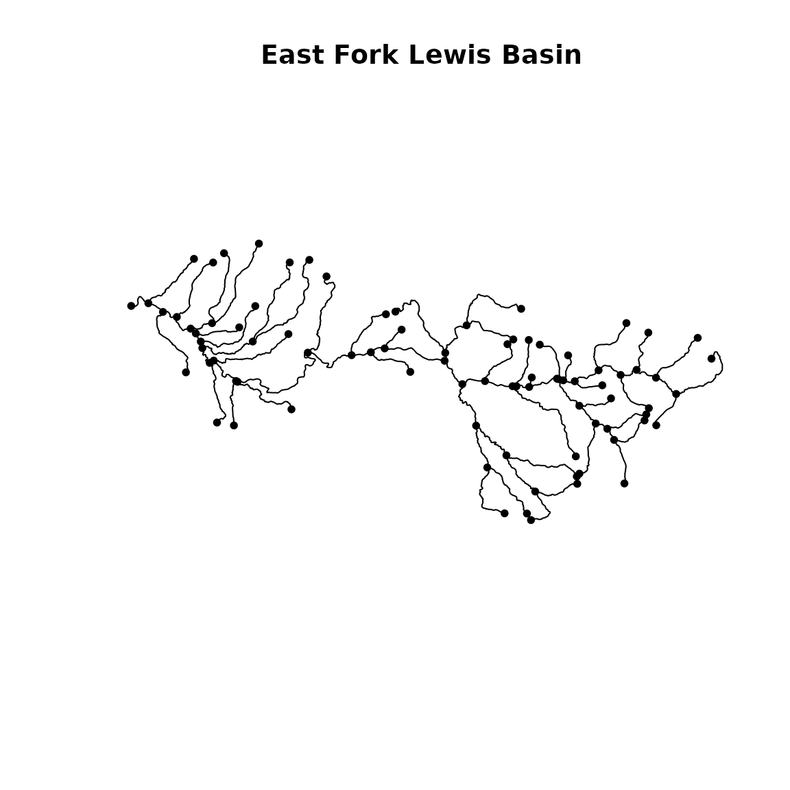
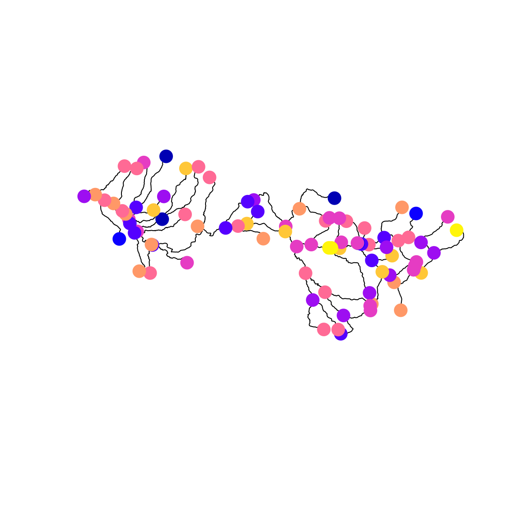
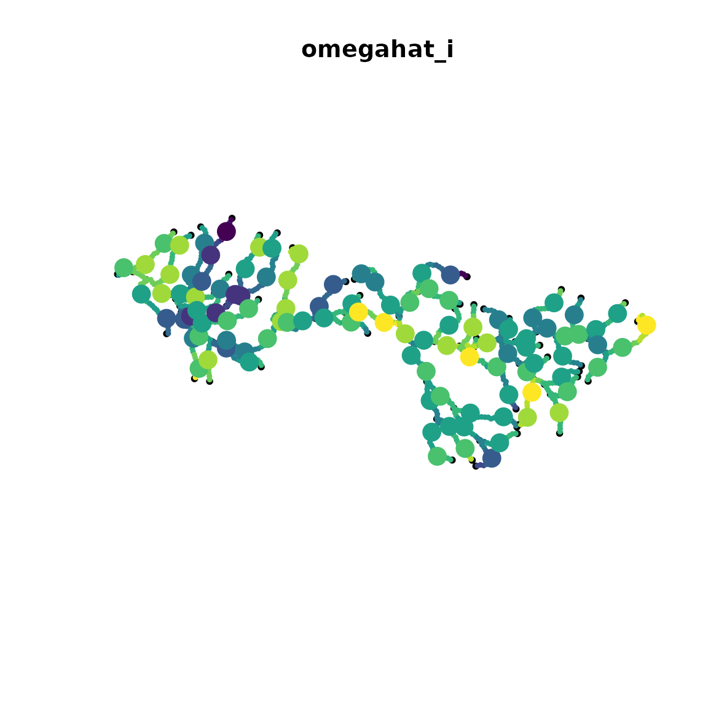

# Stream network models

``` r
library(sf)
library(sfnetworks)
library(tinyVAST)
library(viridisLite)
set.seed(101)
options("tinyVAST.verbose" = FALSE)
```

`tinyVAST` is an R package for fitting vector autoregressive
spatio-temporal (VAST) models using a minimal and user-friendly
interface. We here show how it can fit a stream network model, where
spatial correlations arise from stream distances along a network Hocking
et al. (2018).

## Load and format spatial domain

First, we load a shapefile representing a stream network, and convert it
to *sfnetwork* format. This format includes edges representing stream
segments, and nodes where edges connect.

``` r
stream <- st_read( file.path(system.file("stream_network",package="tinyVAST"),
                   "East_Fork_Lewis_basin.shp"), quiet=TRUE )
stream = as_sfnetwork(stream)
plot(stream, main="East Fork Lewis Basin")
```



We then convert it to an S3 class “sfnetwork_mesh” defined by *tinyVAST*
for stream networks, and rescale distances to 1000 ft (to ensure that
distances are 0.01 to 100, avoiding issues of numerical under or
overflow).

``` r
# Rescale
graph = sfnetwork_mesh( stream )
graph$table$dist = graph$table$dist / 1000  # Convert distance scale
```

## Simulate data

Next, we’ll simulate a Gaussian Markov random field at stream vertices
using `simulate_sfnetwork`, sample evenly spaced locations along the
stream using `st_line_sample`, project the GMRF to those locations using
`sfnetwork_evaluator`, and simulate data at those locations:

``` r
# Parameters
alpha = 2
kappa = 0.05
# mean(graph$table$dist) * kappa = 0.63 -> exp(-0.63) = 0.5 average correlation

# simulate
omega_s = simulate_sfnetwork( n=1, sfnetwork_mesh=graph, theta=kappa)[,1]

# sample locations along network
extrap = st_union( st_line_sample( activate(stream,"edges"), density=1/10000))
extrap = st_cast( extrap, "POINT" )

# Project to sampled locations
A_is = sfnetwork_evaluator( stream = graph$stream,
                                loc = st_coordinates(extrap) )
omega_i = (A_is %*% omega_s)[,1]

# Simulate sampling
#Count = rpois( n=graph$n, lambda=exp(alpha + omega) )
Count_i = rnorm( n=length(omega_i), mean=alpha + omega_i, sd=0.5 )

# Format into long-form data frame expected by tinyVAST
Data = data.frame( Count = Count_i,
                   st_coordinates(extrap),
                   var = "species",  # Univariate model so only one value
                   time = "2020",    # no time-dynamics, so only one value
                   dist = "obs" )    # only one type of sampling in data
```

We can visualize the GMRF at those locations using *sfnetwork*

``` r
# Plot stream
plot(stream)
# Extract nodes and plot on network
plot( st_sf(st_geometry(activate(stream,"nodes")), "omega"=omega_s),
      add=TRUE, pch=19, cex=2)
```



## Fit model

Finally, we can fit the model:

``` r
# fit model
out = tinyVAST( data = Data,
           formula = Count ~ 1,
           spatial_domain = graph,
           space_column = c("X","Y"),
           variable_column = "var",
           time_column = "time",
           distribution_column = "dist",
           space_term = "" )
```

We then predict the GMRF at dense locations along the stream network,
and plot those with the true (simulated) values at the location of
simulated samples.

``` r
# Define plotting points
sf_plot = st_union( st_line_sample( activate(stream,"edges"), density=1/1000))
sf_plot = st_cast( sf_plot, "POINT" )

# Format as `newdata` for prediction
newdata = data.frame( 
  Count = NA,
  st_coordinates(sf_plot),
  var = "species",  # Univariate model so only one value
  time = "2020",    # no time-dynamics, so only one value
  dist = "obs"    # only one type of sampling in data
)

# Extract predicted spatial variable
omega_plot = predict( out, newdata = newdata )

# Plot stream object
plot( 
  stream, 
  main="omegahat_i"
)

# Add predicted spatial variable
plot( 
  st_sf(sf_plot,"omega"=omega_plot), 
  add=TRUE, pch=19, cex=0.5, pal=viridis 
)

# Add true (simulated) values
plot( 
  st_sf(extrap,"omega"=omega_i), 
  add=TRUE, pch=19, cex=2, pal=viridis 
)
```



Runtime for this vignette: 4.51 secs

## Works cited

Charsley, Anthony R., Arnaud Grüss, James T. Thorson, Merrill B. Rudd,
Shannan K. Crow, Bruno David, Erica K. Williams, and Simon D. Hoyle.
2023. “Catchment-Scale Stream Network Spatio-Temporal Models, Applied to
the Freshwater Stages of a Diadromous Fish Species, Longfin Eel
(Anguilla Dieffenbachii).” *Fisheries Research* 259 (March): 106583.
<https://doi.org/10.1016/j.fishres.2022.106583>.

Hocking, Daniel J., James T. Thorson, Kyle O’Neil, and Benjamin H.
Letcher. 2018. “A Geostatistical State-Space Model of Animal Densities
for Stream Networks.” *Ecological Applications* 28 (7): 1782–96.
<https://doi.org/10.1002/eap.1767>.
