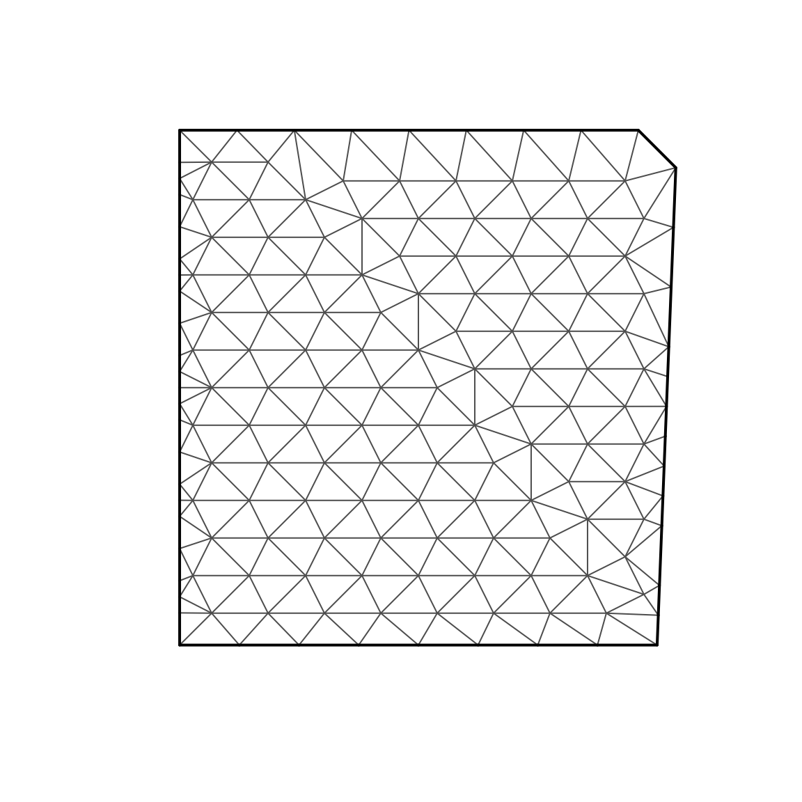
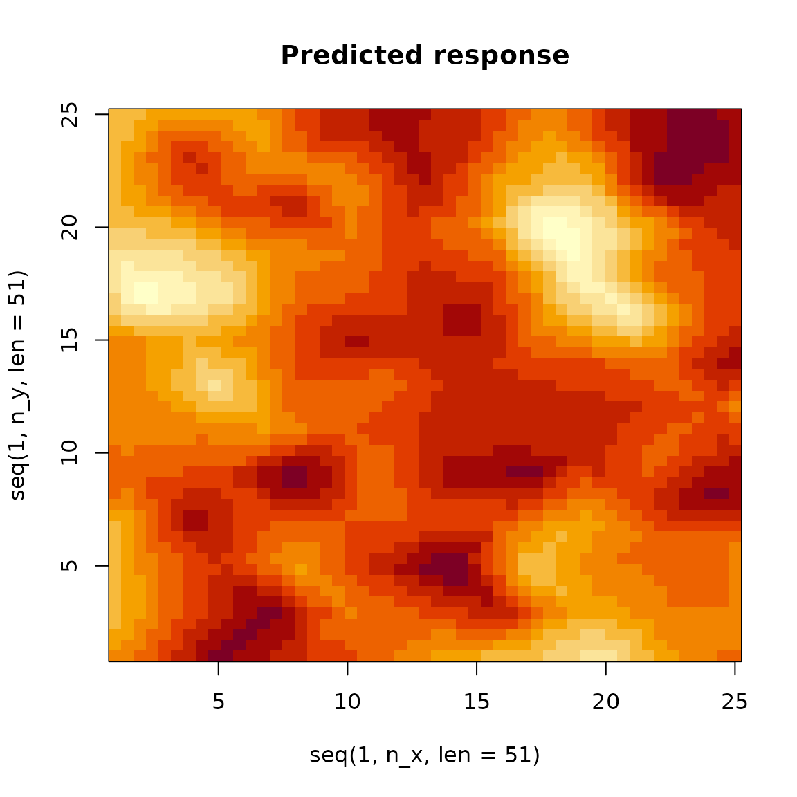
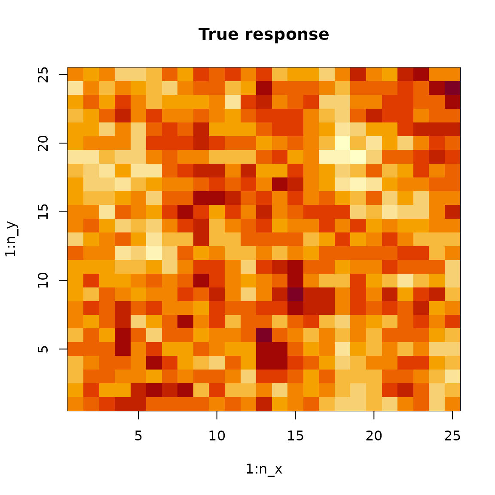
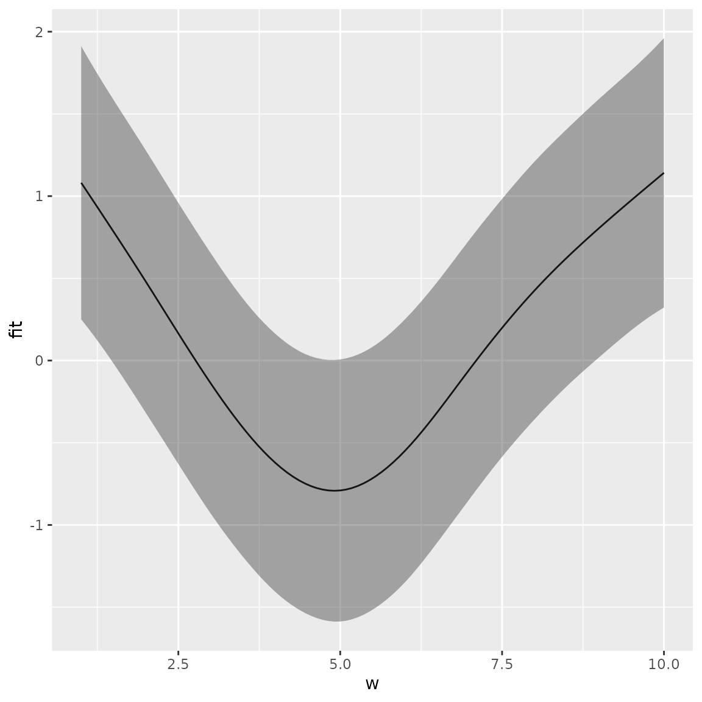

# Spatial modeling

``` r
library(tinyVAST)
library(mgcv)
library(fmesher)
library(pdp)  # approx = TRUE gives effects for average of other covariates
library(lattice)
library(ggplot2)
set.seed(101)
options("tinyVAST.verbose" = FALSE)
```

`tinyVAST` is an R package for fitting vector autoregressive
spatio-temporal (VAST) models using a minimal and user-friendly
interface. We here show how it can fit spatial autoregressive model. We
first simulate a spatial random field and a confounder variable, and
simulate data from this simulated process.

``` r
# Simulate a 2D AR1 spatial process with a cyclic confounder w
n_x = n_y = 25
n_w = 10
R_xx = exp(-0.4 * abs(outer(1:n_x, 1:n_x, FUN="-")) )
R_yy = exp(-0.4 * abs(outer(1:n_y, 1:n_y, FUN="-")) )
z = mvtnorm::rmvnorm(1, sigma=kronecker(R_xx,R_yy) )

# Simulate nuissance parameter z from oscillatory (day-night) process
w = sample(1:n_w, replace=TRUE, size=length(z))
Data = data.frame( expand.grid(x=1:n_x, y=1:n_y), w=w, z=as.vector(z) + cos(w/n_w*2*pi))
Data$n = Data$z + rnorm(nrow(Data), sd=1)

# Add columns for multivariate and temporal dimensions
Data$var = "density"
Data$time = 2020
```

We next construct a triangulated mesh that represents our continuous
spatial domain

``` r
# make mesh
mesh = fm_mesh_2d( Data[,c('x','y')], cutoff = 2 )

# Plot it
plot(mesh)
```



Finally, we can fit these data using `tinyVAST`

``` r
# Define sem, with just one variance for the single variable
sem = "
  density <-> density, spatial_sd
"

# fit model
out = tinyVAST( data = Data,
           formula = n ~ s(w),
           spatial_domain = mesh,
           control = tinyVASTcontrol(getsd=FALSE),
           space_term = sem)
```

We can then calculate the area-weighted total abundance:

``` r
# Predicted sample-weighted total
integrate_output(out, newdata = out$data)
#>            Estimate          Std. Error Est. (bias.correct) Std. (bias.correct) 
#>          -104.15000            29.90546          -104.15000                  NA
# integrate_output(out, apply.epsilon=TRUE )
# predict(out)

# True (latent) sample-weighted total
sum( Data$z )
#> [1] -92.89517
```

## Percent deviance explained

We can compute deviance residuals and percent-deviance explained:

``` r
# Percent deviance explained
out$deviance_explained
#> [1] 0.5051626
```

We can then compare this with the PDE reported by `mgcv`

``` r
start_time = Sys.time()
mygam = gam( n ~ s(w) + s(x,y), data=Data ) #
Sys.time() - start_time
#> Time difference of 0.03249884 secs
summary(mygam)$dev.expl
#> [1] 0.3517756
```

where this comparison shows that using the SPDE method in tinyVAST
results in higher percent-deviance-explained. This reduced performance
for splines relative to the SPDE method presumably arises due to the
reduced rank of the spline basis expansion, and the better match for the
Matern function (in the SPDE method) relative to the true (simulated)
exponential semivariogram.

It is then easy to confirm that mgcv and tinyVAST give (essentially)
identical PDE when switching tinyVAST to use the same bivariate spline
for space.

``` r
out_reduced = tinyVAST( data = Data,
                        formula = n ~ s(w) + s(x,y) )

# Extract PDE for GAM-style spatial smoother in tinyVAST
out_reduced$deviance_explained
#> [1] 0.3497174
```

## Visualize spatial response

`tinyVAST` then has a standard `predict` function:

``` r
predict(out, newdata=data.frame(x=1, y=1, time=1, w=1, var="density") )
#> [1] 0.3649897
```

and this is used to compute the spatial response

``` r
# Prediction grid
pred = outer( seq(1,n_x,len=51),
              seq(1,n_y,len=51),
              FUN=\(x,y) predict(out,newdata=data.frame(x=x,y=y,w=1,time=1,var="density")) )
image( x=seq(1,n_x,len=51), y=seq(1,n_y,len=51), z=pred, main="Predicted response" )
```



``` r

# True value
image( x=1:n_x, y=1:n_y, z=matrix(Data$z,ncol=n_y), main="True response" )
```



We can also compute the marginal effect of the cyclic confounder

``` r
# compute partial dependence plot
Partial = partial( object = out,
                   pred.var = "w",
                   pred.fun = \(object,newdata) predict(object,newdata),
                   train = Data,
                   approx = TRUE )

# Lattice plots as default option
plotPartial( Partial )
```


Alternatively, we can use the `predict` function to plot confidence
intervals for marginal effects, although this is disabled on CRAN
vignettes:

``` r
# create new data frame
newdata <- data.frame(w = seq(min(Data$w), max(Data$w), length.out = 100))
newdata = cbind( newdata, 'x'=13, 'y'=13, 'var'='density', 'time'=2020 )

# make predictions
p <- predict( out, newdata=newdata, se.fit=TRUE, what="p_g" )

# Format as data frame and plot
p = data.frame( newdata, as.data.frame(p) )
ggplot(p, aes(x=w, y=fit,
  ymin = fit - 1.96 * se.fit, ymax = fit + 1.96 * se.fit)) +
  geom_line() + geom_ribbon(alpha = 0.4)
```



Runtime for this vignette: 4.6 secs
