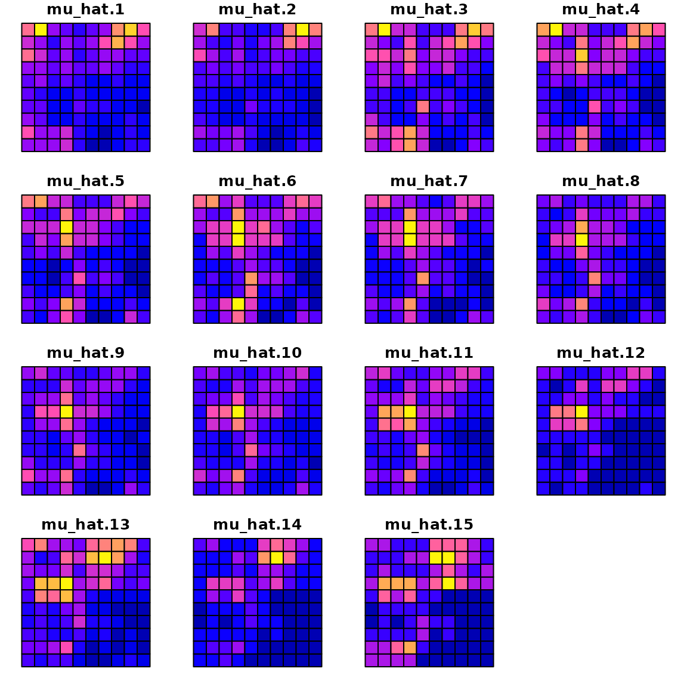
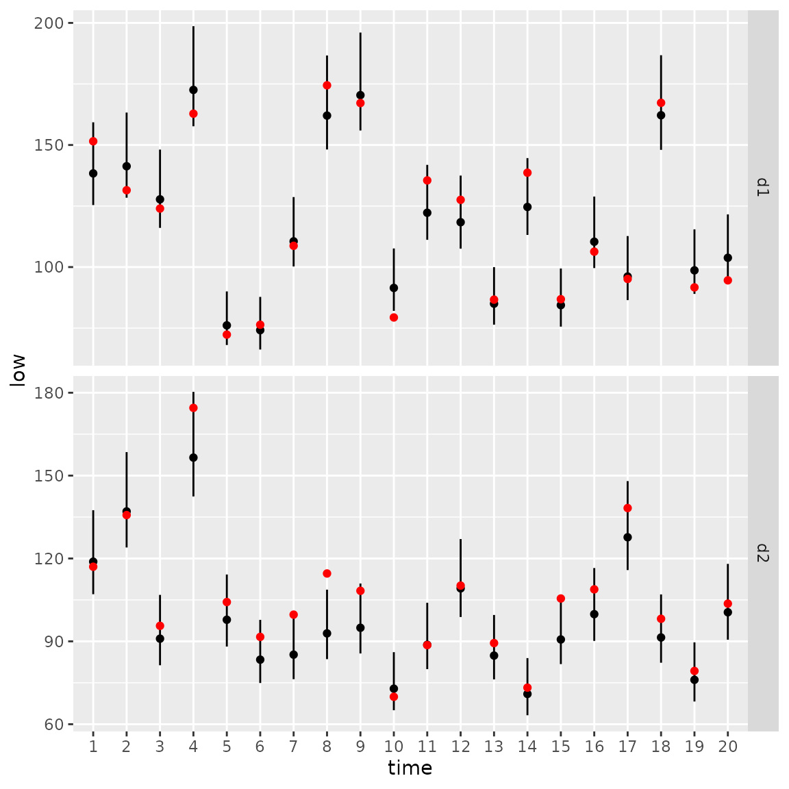

# Vector autoregressive spatio-temporal models

``` r
library(tinyVAST)
library(fmesher)
set.seed(101)
options("tinyVAST.verbose" = FALSE)
```

`tinyVAST` is an R package for fitting vector autoregressive
spatio-temporal (VAST) models. We here explore the capacity to specify
the vector-autoregressive spatio-temporal component.

## Univariate spatio-temporal autoregressive model

We first explore the ability to specify a first-order autoregressive
spatio-temporal process, i.e., a spatial Gompertz model (Thorson et al.
2014).

### Simulate univariate autoregressive process

To do so, we simulate the process:

``` r
# Simulate settings
theta_xy = 0.4
n_x = n_y = 10
n_t = 15
rho = 0.8
spacetime_sd = 0.5
space_sd = 0.5
gamma = 0

# Simulate GMRFs
R_s = exp(-theta_xy * abs(outer(1:n_x, 1:n_y, FUN="-")) )
R_ss = kronecker(R_s, R_s)
Vspacetime_ss = spacetime_sd^2 * R_ss 
Vspace_ss = space_sd^2 * R_ss

# make spacetime AR1 over time
eps_ts = mvtnorm::rmvnorm( n_t, sigma=Vspacetime_ss )
for( t in seq_len(n_t) ){
  if(t>1) eps_ts[t,] = rho*eps_ts[t-1,] + eps_ts[t,]/(1 + rho^2)
}

# make space term
omega_s = mvtnorm::rmvnorm( 1, sigma=Vspace_ss )[1,]

# linear predictor
p_ts = gamma + outer( rep(1,n_t),omega_s ) + eps_ts

# Shape into longform data-frame and add error
Data = data.frame( expand.grid(time=1:n_t, x=1:n_x, y=1:n_y), 
                   var = "logn", 
                   mu = exp(as.vector(p_ts)) )
Data$n = tweedie::rtweedie( n=nrow(Data), mu=Data$mu, phi=0.5, power=1.5 )
mean(Data$n==0)
#> [1] 0.072
```

### Fit univariate spatio-temporal model

We then specify and fit the same model

``` r
# make mesh
mesh = fm_mesh_2d( Data[,c('x','y')] )

# Spatial variable
space_term = "
  logn <-> logn, sd_space
"

# AR1 spatio-temporal variable
spacetime_term = "
  logn -> logn, 1, rho
  logn <-> logn, 0, sd_spacetime
"

# fit model
mytinyVAST = tinyVAST( 
  space_term = space_term,
  spacetime_term = spacetime_term,
  data = Data,
  formula = n ~ 1,
  spatial_domain = mesh,
  family = tweedie() 
)
mytinyVAST
#> Call: 
#> tinyVAST(formula = n ~ 1, data = Data, space_term = space_term, 
#>     spacetime_term = spacetime_term, family = tweedie(), spatial_domain = mesh)
#> 
#> Run time: 
#> Time difference of 8.171958 secs
#> 
#> Family: 
#> $obs
#> 
#> Family: tweedie 
#> Link function: log 
#> 
#> 
#> 
#> 
#> sdreport(.) result
#>              Estimate Std. Error
#> alpha_j   -0.51039962 0.20682402
#> beta_z     0.84975932 0.07526407
#> beta_z    -0.25841509 0.03730060
#> theta_z    0.44410026 0.06898305
#> log_sigma -0.64811725 0.05006776
#> log_sigma  0.01446391 0.06494065
#> log_kappa -0.15609782 0.16446773
#> Maximum gradient component: 0.00235749 
#> 
#> Proportion conditional deviance explained: 
#> [1] 0.4812353
#> 
#> space_term: 
#>   heads   to from parameter start  Estimate  Std_Error  z_value      p_value
#> 1     2 logn logn         1  <NA> 0.4441003 0.06898305 6.437817 1.212041e-10
#> 
#> spacetime_term: 
#>   heads   to from parameter start lag   Estimate  Std_Error   z_value
#> 1     1 logn logn         1  <NA>   1  0.8497593 0.07526407 11.290372
#> 2     2 logn logn         2  <NA>   0 -0.2584151 0.03730060 -6.927908
#>        p_value
#> 1 1.464154e-29
#> 2 4.271107e-12
#> 
#> Fixed terms: 
#>               Estimate Std_Error   z_value    p_value
#> (Intercept) -0.5103996  0.206824 -2.467797 0.01359475
#> 
#> Sanity check: 
#> 
#> **Possible issues detected! Check output of sanity().**
```

The estimated values for `beta_z` then correspond to the simulated value
for `rho` and `spatial_sd`.

We can compare the true densities:

``` r
library(sf)
data_wide = reshape( Data[,c('x','y','time','mu')],
                     direction = "wide", idvar = c('x','y'), timevar = "time")
sf_data = st_as_sf( data_wide, coords=c("x","y"))
sf_grid = sf::st_make_grid( sf_data )
sf_plot = st_sf(sf_grid, st_drop_geometry(sf_data) )
plot(sf_plot, max.plot=n_t )
```


with the estimated densities:

``` r
Data$mu_hat = predict(mytinyVAST)
data_wide = reshape( Data[,c('x','y','time','mu_hat')],
                     direction = "wide", idvar = c('x','y'), timevar = "time")
sf_data = st_as_sf( data_wide, coords=c("x","y"))
sf_plot = st_sf(sf_grid, st_drop_geometry(sf_data) )
plot(sf_plot, max.plot=n_t )
```



where a scatterplot shows that they are highly correlated:

``` r
plot( x=Data$mu, y=Data$mu_hat )
```


We can also use the `DHARMa` package to visualize simulation residuals:

``` r
# simulate new data conditional on fixed effects
# and sampling random effects from their predictive distribution
y_ir = simulate(mytinyVAST, nsim=100, type="mle-mvn")

#
res = DHARMa::createDHARMa( simulatedResponse = y_ir, 
                            observedResponse = Data$n, 
                            fittedPredictedResponse = fitted(mytinyVAST) )
plot(res)
```


We can then calculate the area-weighted total abundance and compare it
with its true value:

``` r
# Predicted sample-weighted total
(Est = sapply( seq_len(n_t),
   FUN=\(t) integrate_output(mytinyVAST, newdata=subset(Data,time==t)) ))
#>                          [,1]      [,2]      [,3]      [,4]     [,5]      [,6]
#> Estimate            69.774447 68.167140 68.249630 64.038614 58.73677 60.506551
#> Std. Error           4.733492  4.404923  4.324752  4.092695  3.88048  3.887898
#> Est. (bias.correct) 72.867385 71.288095 71.442818 67.062659 61.53693 63.391164
#> Std. (bias.correct)        NA        NA        NA        NA       NA        NA
#>                          [,7]      [,8]      [,9]     [,10]     [,11]     [,12]
#> Estimate            54.977472 58.463750 64.523936 74.895753 84.490828 76.981717
#> Std. Error           3.772124  3.863061  4.166782  4.702733  5.335558  5.141674
#> Est. (bias.correct) 57.610590 61.214901 67.544370 78.337004 88.253708 80.405033
#> Std. (bias.correct)        NA        NA        NA        NA        NA        NA
#>                         [,13]      [,14]     [,15]
#> Estimate            87.189069  96.106447 93.626602
#> Std. Error           5.514166   6.001112  6.338957
#> Est. (bias.correct) 91.106034 100.570723 98.734193
#> Std. (bias.correct)        NA         NA        NA

# True (latent) sample-weighted total
(True = tapply( Data$mu, INDEX=Data$time, FUN=sum ))
#>         1         2         3         4         5         6         7         8 
#>  70.98033  70.14925  68.40932  68.70763  58.38332  65.95801  60.52297  55.14115 
#>         9        10        11        12        13        14        15 
#>  60.02083  74.91768  86.40811  77.73359  85.88998  98.33442 105.16020

#
Index = data.frame( time=seq_len(n_t), t(Est), True )
Index$low = Index[,'Est...bias.correct.'] - 1.96*Index[,'Std..Error']
Index$high = Index[,'Est...bias.correct.'] + 1.96*Index[,'Std..Error']

#
library(ggplot2)
ggplot(Index, aes(time, Estimate)) +
  geom_ribbon(aes(ymin = low,
                  ymax = high),    # shadowing cnf intervals
              fill = "lightgrey") +
  geom_line( color = "black",
            linewidth = 1) +
  geom_point( aes(time, True), color = "red" )
```


### Comparison with VAST or sdmTMB

Next, we compare this against the current version of VAST (Thorson and
Barnett 2017)

``` r
settings = make_settings( 
  purpose="index3",
  n_x = n_x*n_y,
  Region = "Other",
  bias.correct = FALSE,
  use_anisotropy = FALSE 
)
settings$FieldConfig['Epsilon','Component_1'] = 0
settings$FieldConfig['Omega','Component_1'] = 0
settings$RhoConfig['Epsilon2'] = 4
settings$RhoConfig[c('Beta1','Beta2')] = 3
settings$ObsModel = c(10,2)

# Run VAST
myVAST = fit_model( 
  settings=settings,
  Lat_i = Data$y,
  Lon_i = Data$x,
  t_i = Data$time,
  b_i = as.numeric(Data$n),
  a_i = rep(1,nrow(Data)),
  observations_LL = cbind(Lat=Data[,'y'],Lon=Data[,'x']),
  grid_dim_km = c(100,100),
  newtonsteps = 0,
  loopnum = 1,
  control = list(eval.max = 10000, iter.max = 10000, trace = 0) 
)
```

``` r
myVAST
```

Or with sdmTMB (Anderson et al. n.d.)

``` r
library(sdmTMB)
sdmTMB_mesh = make_mesh(Data, c("x","y"), n_knots=n_x*n_y )

start_time2 = Sys.time()
mysdmTMB = sdmTMB(
  formula = n ~ 1,
  data = Data,
  mesh = sdmTMB_mesh,
  spatial = "on",
  spatiotemporal = "ar1",
  time = "time",
  family = tweedie()
)
sdmTMBtime = Sys.time() - start_time2
```

The models all have similar runtimes

``` r
Times = data.frame( 
  tinyVAST = mytinyVAST$run_time,
  VAST = myVAST$total_time,
  sdmTMB = sdmTMBtime 
)
knitr::kable( cbind("run times (sec.)"=Times), digits=1)
```

| run times (sec.).tinyVAST | run times (sec.).VAST | run times (sec.).sdmTMB |
|:--------------------------|:----------------------|:------------------------|
| 8.2 secs                  | NA                    | 10.4 secs               |

### Delta models

We can also fit this univariate spatio-temporal process using a
Poisson-linked gamma delta model (Thorson 2018)

``` r
# fit model
mydelta2 = tinyVAST( 
  data = Data,
  formula = n ~ 1,
  delta_options = list(
    formula = ~ 0 + factor(time),
    spacetime_term = "logn -> logn, 1, rho"),
  family = delta_lognormal(type="poisson-link"),
  spatial_domain = mesh 
)

mydelta2
#> Call: 
#> tinyVAST(formula = n ~ 1, data = Data, family = delta_lognormal(type = "poisson-link"), 
#>     delta_options = list(formula = ~0 + factor(time), spacetime_term = "logn -> logn, 1, rho"), 
#>     spatial_domain = mesh)
#> 
#> Run time: 
#> Time difference of 7.94924 secs
#> 
#> Family: 
#> $obs
#> 
#> Family: binomial lognormal 
#> Link function: log log 
#> 
#> 
#> 
#> 
#> sdreport(.) result
#>             Estimate Std. Error
#> alpha_j    0.9673982 0.03523113
#> alpha2_j  -1.2465531 0.14981116
#> alpha2_j  -1.2927804 0.17500264
#> alpha2_j  -1.3056616 0.19172295
#> alpha2_j  -1.3218115 0.20304344
#> alpha2_j  -1.5709922 0.21258960
#> alpha2_j  -1.4450793 0.21945079
#> alpha2_j  -1.7167974 0.22626434
#> alpha2_j  -1.5448634 0.23247502
#> alpha2_j  -1.3990617 0.23308060
#> alpha2_j  -1.1251748 0.23638081
#> alpha2_j  -1.2235461 0.23877445
#> alpha2_j  -1.5131381 0.24006161
#> alpha2_j  -1.2469233 0.24216447
#> alpha2_j  -1.1278738 0.24209141
#> alpha2_j  -1.0707282 0.24334575
#> beta2_z    0.8967400 0.03512556
#> beta2_z    0.3133328 0.03906544
#> log_sigma  0.0296271 0.02475190
#> log_kappa  0.1085638 0.14818576
#> Maximum gradient component: 0.001977891 
#> 
#> Proportion conditional deviance explained: 
#> [1] 0.3295031
#> 
#> Fixed terms: 
#>              Estimate  Std_Error  z_value       p_value
#> (Intercept) 0.9673982 0.03523113 27.45862 5.482304e-166
#> 
#> Sanity check: 
#> 
#> **Possible issues detected! Check output of sanity().**
```

And we can again use the `DHARMa` package (Hartig 2017) to visualize
conditional simulation quantile (a.k.a. Dunn-Smythe) residuals (Dunn and
Smyth 1996):

``` r
# simulate new data conditional on fixed effects
# and sampling random effects from their predictive distribution
y_ir = simulate(mydelta2, nsim=100, type="mle-mvn")

# Visualize using DHARMa
res = DHARMa::createDHARMa( simulatedResponse = y_ir, 
                            observedResponse = Data$n, 
                            fittedPredictedResponse = fitted(mydelta2) )
plot(res)
```


We can then use marginal and conditional AIC to compare the fit of the
delta-model and Tweedie distribution:

``` r
# AIC table
AIC_table = cbind(
  mAIC = c( "Tweedie" = AIC(mytinyVAST), 
            "delta-lognormal" = AIC(mydelta2) ), 
  cAIC = c( "Tweedie" = tinyVAST::cAIC(mytinyVAST), 
            "delta-lognormal" = tinyVAST::cAIC(mydelta2) ) 
)

# Print table
knitr::kable( 
  AIC_table,
  digits=3
)
```

|                 |     mAIC |     cAIC |
|:----------------|---------:|---------:|
| Tweedie         | 2501.480 | 2356.787 |
| delta-lognormal | 2947.194 | 2848.163 |

## Bivariate vector autoregressive spatio-temporal model

We next highlight how to specify a bivariate spatio-temporal model with
a cross-laggged (vector autoregressive) interaction Thorson, Adams, and
Holsman (2019). \## Simulate bivariate model

We first simulate artificial data for the sake of demonstration:

``` r
# Simulate settings
theta_xy = 0.2
n_x = n_y = 10
n_t = 20
B = rbind( c( 0.5, -0.25),
           c(-0.1,  0.50) )

# Simulate GMRFs
R = exp(-theta_xy * abs(outer(1:n_x, 1:n_y, FUN="-")) )
d1 = mvtnorm::rmvnorm(n_t, sigma=0.2*kronecker(R,R) )
d2 = mvtnorm::rmvnorm(n_t, sigma=0.2*kronecker(R,R) )
d = abind::abind( d1, d2, along=3 )

# Project through time and add mean
for( t in seq_len(n_t) ){
  if(t>1) d[t,,] = t(B%*%t(d[t-1,,])) + d[t,,]
}

# Shape into longform data-frame and add error
Data = data.frame( expand.grid(time=1:n_t, x=1:n_x, y=1:n_y, "var"=c("d1","d2")),
                   mu = exp(as.vector(d)))
Data$n = tweedie::rtweedie( n=nrow(Data), mu=Data$mu, phi=0.5, power=1.5 )
```

### Fit bivariate model

We next set up inputs and run the model:

``` r
# make mesh
mesh = fm_mesh_2d( Data[,c('x','y')] )

# Define DSEM
dsem = "
  d1 -> d1, 1, b11
  d2 -> d2, 1, b22
  d2 -> d1, 1, b21
  d1 -> d2, 1, b12
  d1 <-> d1, 0, var1
  d2 <-> d2, 0, var1
"

# fit model
out = tinyVAST( spacetime_term = dsem,
           data = Data,
           formula = n ~ 0 + var,
           spatial_domain = mesh,
           family = tweedie() )
#> Warning: The model may not have converged. Maximum final gradient:
#> 0.0108368453778236.
out
#> Call: 
#> tinyVAST(formula = n ~ 0 + var, data = Data, spacetime_term = dsem, 
#>     family = tweedie(), spatial_domain = mesh)
#> 
#> Run time: 
#> Time difference of 28.38587 secs
#> 
#> Family: 
#> $obs
#> 
#> Family: tweedie 
#> Link function: log 
#> 
#> 
#> 
#> 
#> sdreport(.) result
#>               Estimate Std. Error
#> alpha_j    0.090202981 0.11486664
#> alpha_j   -0.099500541 0.10318987
#> beta_z     0.553897565 0.07628808
#> beta_z     0.536424139 0.07383380
#> beta_z    -0.225705467 0.07606824
#> beta_z    -0.070945613 0.06259109
#> beta_z     0.336688292 0.01863795
#> log_sigma -0.696754581 0.02881155
#> log_sigma -0.005321748 0.05462454
#> log_kappa -0.635425879 0.10547175
#> Maximum gradient component: 0.01083685 
#> 
#> Proportion conditional deviance explained: 
#> [1] 0.4057952
#> 
#> spacetime_term: 
#>   heads to from parameter start lag    Estimate  Std_Error   z_value
#> 1     1 d1   d1         1  <NA>   1  0.55389757 0.07628808  7.260604
#> 2     1 d2   d2         2  <NA>   1  0.53642414 0.07383380  7.265293
#> 3     1 d1   d2         3  <NA>   1 -0.22570547 0.07606824 -2.967144
#> 4     1 d2   d1         4  <NA>   1 -0.07094561 0.06259109 -1.133478
#> 5     2 d1   d1         5  <NA>   0  0.33668829 0.01863795 18.064666
#> 6     2 d2   d2         5  <NA>   0  0.33668829 0.01863795 18.064666
#>        p_value
#> 1 3.853647e-13
#> 2 3.722318e-13
#> 3 3.005797e-03
#> 4 2.570136e-01
#> 5 6.048658e-73
#> 6 6.048658e-73
#> 
#> Fixed terms: 
#>          Estimate Std_Error    z_value   p_value
#> vard1  0.09020298 0.1148666  0.7852844 0.4322868
#> vard2 -0.09950054 0.1031899 -0.9642471 0.3349220
#> 
#> Sanity check: 
#> 
#> **Possible issues detected! Check output of sanity().**
```

The values for `beta_z` again correspond to the specified value for
interaction-matrix `B`

We can again calculate the area-weighted total abundance and compare it
with its true value:

``` r
# Predicted sample-weighted total 
# for each year-variable combination
Est1 = Est2 = NULL
for( t in seq_len(n_t) ){
  Est1 = rbind(Est1, integrate_output( 
    out, 
    newdata = subset(Data, time==t & var=="d1")
  ))
  Est2 = rbind(Est2, integrate_output( 
    out, 
    newdata = subset(Data, time==t & var=="d2")
  ))
}

# True (latent) sample-weighted total
True = tapply( 
  Data$mu, 
  INDEX=list("time"=Data$time,"var"=Data$var), 
  FUN=sum 
)

# Make long-form data frame for ggplot
Index = data.frame( 
  expand.grid(dimnames(True)), 
  True = as.vector(True),
  rbind(Est1, Est2)
)

# Format intervals for ggplot
Index$low = Index[,'Est...bias.correct.'] - 1.96*Index[,'Std..Error']
Index$high = Index[,'Est...bias.correct.'] + 1.96*Index[,'Std..Error']

#
library(ggplot2)
ggplot(Index, aes( time, Estimate )) +
  facet_grid( rows=vars(var), scales="free" ) +
  geom_segment(aes(y = low,
                  yend = high,
                  x = time,
                  xend = time) ) +
  geom_point( aes(x=time, y=Estimate), color = "black") +
  geom_point( aes(x=time, y=True), color = "red" )
```



## Works cited

Anderson, Sean C., Eric J. Ward, Philina A. English, Lewis A. K.
Barnett, and James T. Thorson. n.d. “sdmTMB: An R Package for Fast,
Flexible, and User-Friendly Generalized Linear Mixed Effects Models with
Spatial and Spatiotemporal Random Fields.” *Journal of Open Source
Software*, 2022.03.24.485545. Accessed March 10, 2025.
<https://doi.org/10.1101/2022.03.24.485545>.

Dunn, Peter K., and Gordon K. Smyth. 1996. “Randomized Quantile
Residuals.” *Journal of Computational and Graphical Statistics* 5 (3):
236–44.
<http://www.tandfonline.com/doi/abs/10.1080/10618600.1996.10474708>.

Hartig, Florian. 2017. “DHARMa: Residual Diagnostics for Hierarchical
(Multi-Level/Mixed) Regression Models.” *R Package Version 0.1* 5.

Thorson, James T. 2018. “Three Problems with the Conventional
Delta-Model for Biomass Sampling Data, and a Computationally Efficient
Alternative.” *Canadian Journal of Fisheries and Aquatic Sciences* 75
(9): 1369–82. <https://doi.org/10.1139/cjfas-2017-0266>.

Thorson, James T., Grant Adams, and Kirstin Holsman. 2019.
“Spatio-Temporal Models of Intermediate Complexity for Ecosystem
Assessments: A New Tool for Spatial Fisheries Management.” *Fish and
Fisheries* 20 (6): 1083–99. <https://doi.org/10.1111/faf.12398>.

Thorson, James T., and Lewis A. K. Barnett. 2017. “Comparing Estimates
of Abundance Trends and Distribution Shifts Using Single- and
Multispecies Models of Fishes and Biogenic Habitat.” *ICES Journal of
Marine Science* 74 (5): 1311–21.
<https://doi.org/10.1093/icesjms/fsw193>.

Thorson, James T., Stephan B. Munch, and Douglas P. Swain. 2017.
“Estimating Partial Regulation in Spatiotemporal Models of Community
Dynamics.” *Ecology* 98 (5): 1277–89.
<https://doi.org/10.1002/ecy.1760>.

Thorson, James T., Hans J. Skaug, Kasper Kristensen, Andrew O. Shelton,
Eric J. Ward, John H. Harms, and James A. Benante. 2014. “The Importance
of Spatial Models for Estimating the Strength of Density Dependence.”
*Ecology* 96 (5): 1202–12. <https://doi.org/10.1890/14-0739.1>.
