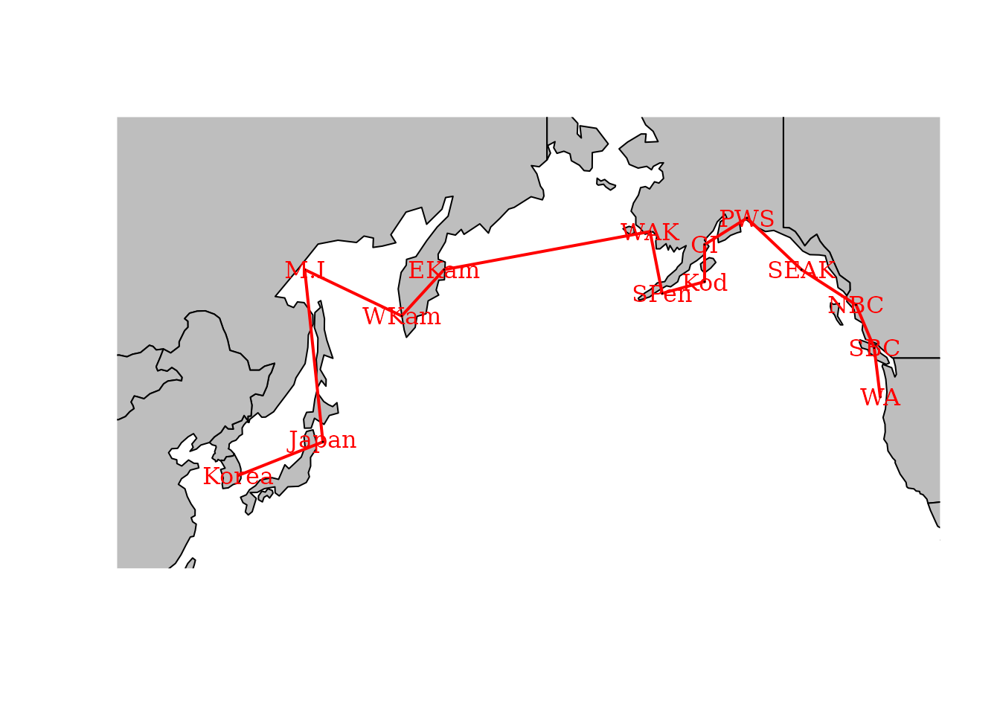
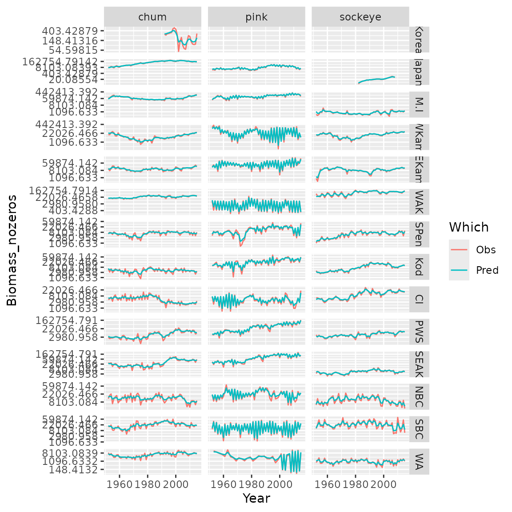

# Simultaneous autoregressive process

``` r

library(tinyVAST)
library(igraph)
library(rnaturalearth)
library(sf)
options("tinyVAST.verbose" = FALSE)
```

`tinyVAST` is an R package for fitting vector autoregressive
spatio-temporal (VAST) models using a minimal and user-friendly
interface. We here show how it can fit a multivariate second-order
autoregressive (AR2) model including spatial correlations using a
simultaneous autoregressive (SAR) process specified using *igraph*.

## Load and format data

To do so, we first load salmong returns, and remove 0s to allow
comparison between Tweedie and lognormal distributions.

``` r

data( salmon_returns )

# Transform data
salmon_returns$Biomass_nozeros = ifelse( salmon_returns$Biomass==0,
                                         NA, salmon_returns$Biomass )
Data = na.omit(salmon_returns)
```

## Analysis

### Independent dynamics among populations

We first explore an AR2 process, with independent variation among
regions. This model shows a substantial first-order autocorrelation for
sockeye and chum, and substantial second-order autocorrelation for pink
salmon. An AR(2) process is stationary if $`\phi_1 + \phi_2 < 1`$ and
$`\phi_2 - \phi_1 < 1`$, and this stationarity criterion suggests that
each time-series is close to (but not quite) nonstationary.

``` r

# Define graph for SAR process
unconnected_graph = make_empty_graph( nlevels(Data$Region) )
V(unconnected_graph)$name = levels(Data$Region)
plot(unconnected_graph)
```


``` r


# Define SEM for AR2 process
dsem = "
  sockeye -> sockeye, 1, lag1_sockeye
  sockeye -> sockeye, 2, lag2_sockeye

  pink -> pink, 1, lag1_pink
  pink -> pink, 2, lag2_pink

  chum -> chum, 1, lag1_chum
  chum -> chum, 2, lag2_chum
"

# Fit tinyVAST model
mytiny0 = tinyVAST(
  formula = Biomass_nozeros ~ 0 + Species + Region,
  data = Data,
  spacetime_term = dsem,
  variable_column = "Species",
  time_column = "Year",
  space_column = "Region",
  distribution_column = "Species",
  family = list( 
    "chum" = lognormal(),
    "pink" = lognormal(),
    "sockeye" = lognormal() 
  ),
  spatial_domain = unconnected_graph,
  control = tinyVASTcontrol( 
    profile = "alpha_j" 
  ) 
)
#> Warning: The model may not have converged. Maximum final gradient:
#> 0.0402331871246707.

# Summarize output
Summary = summary(mytiny0, what="spacetime_term")
knitr::kable( Summary, digits=3)
```

| heads | to      | from    | parameter | start | lag | Estimate | Std_Error | z_value | p_value |
|:------|:--------|:--------|:----------|:------|:----|---------:|----------:|--------:|--------:|
| 1     | sockeye | sockeye | 1         | NA    | 1   |    0.810 |     0.067 |  12.048 |   0.000 |
| 1     | sockeye | sockeye | 2         | NA    | 2   |    0.181 |     0.067 |   2.711 |   0.007 |
| 1     | pink    | pink    | 3         | NA    | 1   |    0.038 |     0.015 |   2.532 |   0.011 |
| 1     | pink    | pink    | 4         | NA    | 2   |    0.943 |     0.017 |  54.224 |   0.000 |
| 1     | chum    | chum    | 5         | NA    | 1   |    0.742 |     0.198 |   3.757 |   0.000 |
| 1     | chum    | chum    | 6         | NA    | 2   |    0.247 |     0.196 |   1.263 |   0.207 |
| 2     | pink    | pink    | 7         | NA    | 0   |    0.525 |     0.035 |  14.788 |   0.000 |
| 2     | chum    | chum    | 8         | NA    | 0   |    0.252 |     0.048 |   5.231 |   0.000 |
| 2     | sockeye | sockeye | 9         | NA    | 0   |    0.361 |     0.036 |   9.943 |   0.000 |

### Spatially correlated dynamics among populations

We also explore an SAR process for adjacency among regions

``` r

# Define graph for SAR process
adjacency_graph = make_graph( ~ Korea - Japan - M.I - WKam - EKam -
                                WAK - SPen - Kod - CI - PWS -
                                SEAK - NBC - SBC - WA )
```

We can plot this adjacency on a map to emphasize that it is a simple way
to encode information about spatial proximity:

``` r

#maps = ne_countries( country = c("united states of america","russia","canada","south korea","north korea","japan") )
maps = ne_countries( continent = c("north america","asia","europe") )
maps = st_combine( maps )
maps = st_transform( maps, crs=st_crs(3832) )

# Format inputs
loc_xy = cbind(
  x = c(129,143,140,156,163,-163,-161,-154,-154,-147,-138,-129,-126,-125),
  y = c(36,40,57,53,57,60,55,56,59,61,57,54,50,45)
)
loc_xy = sf_project( loc_xy, from=st_crs(4326), to=st_crs(3832) )

# Plot
xlim = c(-4,10) * 1e6
ylim = c(3,10) * 1e6
plot( 
  maps, 
  xlim = xlim,
  ylim = ylim,
  col = "grey",
  asp = FALSE,
  add = FALSE 
)
plot( 
  adjacency_graph, 
  layout = loc_xy,
  add = TRUE, 
  rescale = FALSE,
  vertex.label.color = "red",
  xlim = xlim, 
  ylim = ylim, 
  edge.width = 2,
  edge.color = "red" 
)
```



We can then pass this adjacency graph to `tinyVAST` during fitting:

``` r

# Fit tinyVAST model
mytiny = tinyVAST(
  formula = Biomass_nozeros ~ 0 + Species + Region,
  data = Data,
  spacetime_term = dsem,
  variable_column = "Species",
  time_column = "Year",
  space_column = "Region",
  distribution_column = "Species",
  family = list( 
    "chum" = lognormal(),
    "pink" = lognormal(),
    "sockeye" = lognormal() 
  ),
  spatial_domain = adjacency_graph,
  control = tinyVASTcontrol( 
    profile="alpha_j" 
  ) 
)

# Summarize output
Summary = summary(mytiny, what="spacetime_term")
knitr::kable( Summary, digits=3)
```

| heads | to      | from    | parameter | start | lag | Estimate | Std_Error | z_value | p_value |
|:------|:--------|:--------|:----------|:------|:----|---------:|----------:|--------:|--------:|
| 1     | sockeye | sockeye | 1         | NA    | 1   |    1.510 |     0.101 |  15.022 |   0.000 |
| 1     | sockeye | sockeye | 2         | NA    | 2   |   -0.510 |     0.101 |  -5.051 |   0.000 |
| 1     | pink    | pink    | 3         | NA    | 1   |    0.006 |     0.007 |   0.889 |   0.374 |
| 1     | pink    | pink    | 4         | NA    | 2   |    1.018 |     0.007 | 138.731 |   0.000 |
| 1     | chum    | chum    | 5         | NA    | 1   |    1.759 |     0.073 |  24.067 |   0.000 |
| 1     | chum    | chum    | 6         | NA    | 2   |   -0.766 |     0.073 | -10.486 |   0.000 |
| 2     | pink    | pink    | 7         | NA    | 0   |    0.416 |     0.036 |  11.707 |   0.000 |
| 2     | chum    | chum    | 8         | NA    | 0   |    0.070 |     0.016 |   4.387 |   0.000 |
| 2     | sockeye | sockeye | 9         | NA    | 0   |    0.158 |     0.027 |   5.821 |   0.000 |

### Model selection and visualization

We can use AIC to compare these two models. This comparison suggests
that spatial adjancency is not a parsimonious way to describe
correlations among time-series.

``` r

# AIC for unconnected time-series
AIC(mytiny0)
#> [1] 48939.44
# AIC for SAR spatial variation
AIC(mytiny)
#> [1] 49477.36
```

Finally, we can plot observations and predictions for the selected model

``` r

# Compile long-form dataframe of observations and predictions
Resid = rbind( cbind(Data[,c('Species','Year','Region','Biomass_nozeros')], "Which"="Obs"),
               cbind(Data[,c('Species','Year','Region')], "Biomass_nozeros"=predict(mytiny0,Data), "Which"="Pred") )

# plot using ggplot
library(ggplot2)
ggplot( data=Resid, aes(x=Year, y=Biomass_nozeros, col=Which) ) + # , group=yhat.id
  geom_line() +
  facet_grid( rows=vars(Region), cols=vars(Species), scales="free" ) +
  scale_y_continuous(trans='log')  #
```



Runtime for this vignette: 19.9 secs

## Works cited
