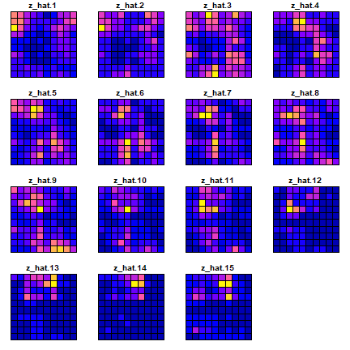
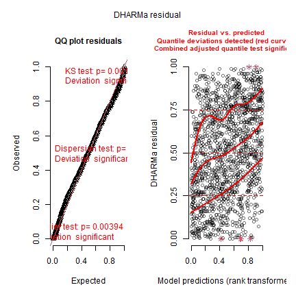
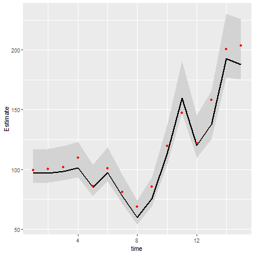
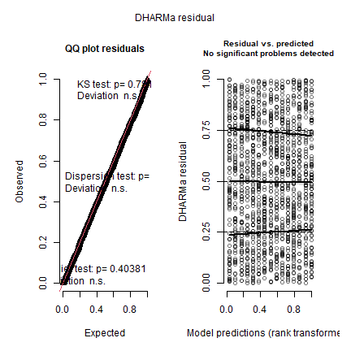
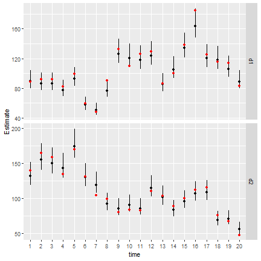

```r
library(tinyVAST)
library(fmesher)
set.seed(101)
options("tinyVAST.verbose" = FALSE)
```

`tinyVAST` is an R package for fitting vector autoregressive spatio-temporal (VAST) models.
We here explore the capacity to specify the vector-autoregressive spatio-temporal component.

# Spatio-temporal autoregressive model
We first explore the ability to specify a first-order autoregressive spatio-temporal process:


```r
# Simulate settings
theta_xy = 0.4
n_x = n_y = 10
n_t = 15
rho = 0.8
spatial_sd = 0.5

# Simulate GMRFs
R_s = exp(-theta_xy * abs(outer(1:n_x, 1:n_y, FUN="-")) )
V_ss = spatial_sd^2*kronecker(R_s, R_s)
d = mvtnorm::rmvnorm(n_t, sigma=V_ss )

# Project through time and add mean
for( t in seq_len(n_t) ){
  if(t>1) d[t,] = rho*d[t-1,] + d[t,]
}
#d = d + 0.5

# Shape into longform data-frame and add error
Data = data.frame( expand.grid(time=1:n_t, x=1:n_x, y=1:n_y), "var"="logn", z=exp(as.vector(d)))
Data$n = tweedie::rtweedie( n=nrow(Data), mu=Data$z, phi=0.5, power=1.5 )
mean(Data$n==0)
#> [1] 0.046

# make mesh
mesh = fm_mesh_2d( Data[,c('x','y')] )

# fit model
mytinyVAST = tinyVAST( dsem = "logn -> logn, 1, rho",
           data = Data,
           formula = n ~ 0 + factor(time),
           spatial_graph = mesh,
           family = tweedie() )
mytinyVAST
#> $call
#> tinyVAST(formula = n ~ 0 + factor(time), data = Data, dsem = "logn -> logn, 1, rho", 
#>     family = tweedie(), spatial_graph = mesh)
#> 
#> $opt
#> $opt$par
#>     alpha_j     alpha_j     alpha_j     alpha_j     alpha_j     alpha_j     alpha_j     alpha_j     alpha_j     alpha_j     alpha_j     alpha_j     alpha_j     alpha_j 
#> -0.08323604 -0.13549104 -0.10579217 -0.14499114 -0.37823869 -0.21633307 -0.41489959 -0.67168423 -0.49463135 -0.13968720  0.14836187 -0.21516693 -0.20120058  0.16887045 
#>     alpha_j      beta_z      beta_z   log_sigma   log_sigma   log_kappa 
#>  0.30040122  0.81229112  0.40988915 -0.64868475  0.04394543  0.07228542 
#> 
#> $opt$objective
#> [1] 1717.689
#> 
#> $opt$convergence
#> [1] 0
#> 
#> $opt$iterations
#> [1] 77
#> 
#> $opt$evaluations
#> function gradient 
#>      107       77 
#> 
#> $opt$message
#> [1] "relative convergence (4)"
#> 
#> 
#> $sdrep
#> sdreport(.) result
#>              Estimate Std. Error
#> alpha_j   -0.08323604 0.15196456
#> alpha_j   -0.13549104 0.18670340
#> alpha_j   -0.10579217 0.20529851
#> alpha_j   -0.14499114 0.21780791
#> alpha_j   -0.37823869 0.22691800
#> alpha_j   -0.21633307 0.23026450
#> alpha_j   -0.41489959 0.23456777
#> alpha_j   -0.67168423 0.23833635
#> alpha_j   -0.49463135 0.23869331
#> alpha_j   -0.13968720 0.23733095
#> alpha_j    0.14836187 0.23640201
#> alpha_j   -0.21516693 0.23873590
#> alpha_j   -0.20120058 0.23979214
#> alpha_j    0.16887045 0.23708655
#> alpha_j    0.30040122 0.23660035
#> beta_z     0.81229112 0.03708631
#> beta_z     0.40988915 0.03291043
#> log_sigma -0.64868475 0.05422114
#> log_sigma  0.04394543 0.07275797
#> log_kappa  0.07228542 0.10755269
#> Maximum gradient component: 0.006315957 
#> 
#> $run_time
#> Time difference of 19.30986 secs
```
The estimated values for `beta_z` then correspond to the simulated value for `rho` and `spatial_sd`.

We can compare the true densities:


```r
library(sf)
data_wide = reshape( Data[,c('x','y','time','z')],
                     direction = "wide", idvar = c('x','y'), timevar = "time")
sf_data = st_as_sf( data_wide, coords=c("x","y"))
sf_grid = sf::st_make_grid( sf_data )
sf_plot = st_sf(sf_grid, st_drop_geometry(sf_data) )
plot(sf_plot, max.plot=n_t )
```


with the estimated densities:

```r
Data$z_hat = predict(mytinyVAST)
data_wide = reshape( Data[,c('x','y','time','z_hat')],
                     direction = "wide", idvar = c('x','y'), timevar = "time")
sf_data = st_as_sf( data_wide, coords=c("x","y"))
sf_plot = st_sf(sf_grid, st_drop_geometry(sf_data) )
plot(sf_plot, max.plot=n_t )
```



where a scatterplot shows that they are highly correlated:

```r
plot( x=Data$z, y=Data$z_hat )
```


We can also use the `DHARMa` package to visualize simulation residuals:

```r
# simulate new data conditional on fixed and random effects
y_ir = replicate( n = 100, 
           expr = mytinyVAST$obj$simulate()$y_i )

#
res = DHARMa::createDHARMa( simulatedResponse = y_ir, 
                            observedResponse = Data$n, 
                            fittedPredictedResponse = fitted(mytinyVAST) )
plot(res)
```



We can then calculate the area-weighted total abundance and compare it with its true value:

```r
# Predicted sample-weighted total
(Est = sapply( seq_len(n_t),
   FUN=\(t) integrate_output(mytinyVAST, newdata=subset(Data,time==t)) ))
#>                           [,1]       [,2]       [,3]       [,4]      [,5]       [,6]      [,7]      [,8]      [,9]      [,10]     [,11]      [,12]     [,13]     [,14]
#> Estimate             97.164902  96.643634  98.362458 101.517620 84.760587  97.538110 77.520820 59.565797 75.752785 113.562128 159.66734 120.156809 137.80745 192.64174
#> Std. Error            7.194683   7.216494   7.309313   7.572241  6.643419   7.406226  6.207919  5.090533  6.144821   8.454587  11.09945   9.107852  10.39448  13.68245
#> Est. (bias.correct) 102.324275 102.850496 105.043004 108.373176 90.604659 104.258111 83.102278 64.065173 81.166864 120.921460 169.20673 127.519259 145.78500 203.55063
#> Std. (bias.correct)         NA         NA         NA         NA        NA         NA        NA        NA        NA         NA        NA         NA        NA        NA
#>                         [,15]
#> Estimate            187.86973
#> Std. Error           12.88189
#> Est. (bias.correct) 200.54754
#> Std. (bias.correct)        NA

# True (latent) sample-weighted total
(True = tapply( Data$z, INDEX=Data$time, FUN=sum ))
#>         1         2         3         4         5         6         7         8         9        10        11        12        13        14        15 
#>  99.21643 100.10603 101.66846 109.52622  85.76973 100.97116  80.99847  68.60738  85.39974 119.62380 147.41437 122.00580 158.26179 200.56813 203.37545

#
Index = data.frame( time=seq_len(n_t), t(Est), True )
Index$low = Index[,'Est...bias.correct.'] - 1.96*Index[,'Std..Error']
Index$high = Index[,'Est...bias.correct.'] + 1.96*Index[,'Std..Error']

#
library(ggplot2)
#> Warning: package 'ggplot2' was built under R version 4.3.3
ggplot(Index, aes(time, Estimate)) +
  geom_ribbon(aes(ymin = low,
                  ymax = high),    # shadowing cnf intervals
              fill = "lightgrey") +
  geom_line( color = "black",
            linewidth = 1) +
  geom_point( aes(time, True), color = "red" )
```



Next, we compare this against the current version of VAST


```r
settings = make_settings( purpose="index3",
                          n_x = n_x*n_y,
                          Region = "Other",
                          bias.correct = FALSE,
                          use_anisotropy = FALSE )
settings$FieldConfig['Epsilon','Component_1'] = 0
settings$FieldConfig['Omega',] = 0
settings$RhoConfig['Epsilon2'] = 4
settings$RhoConfig['Beta1'] = 3
settings$ObsModel = c(10,2)

# Run VAST
myVAST = fit_model( settings=settings,
                 Lat_i = Data[,'y'],
                 Lon_i = Data[,'x'],
                 t_i = Data[,'time'],
                 b_i = Data[,'n'],
                 a_i = rep(1,nrow(Data)),
                 observations_LL = cbind(Lat=Data[,'y'],Lon=Data[,'x']),
                 grid_dim_km = c(100,100),
                 newtonsteps = 0,
                 loopnum = 1,
                 control = list(eval.max = 10000, iter.max = 10000, trace = 0) )
```

```r
myVAST
#> fit_model(.) result
#> $par
#>       beta1_ft       beta2_ft       beta2_ft       beta2_ft       beta2_ft       beta2_ft       beta2_ft       beta2_ft       beta2_ft       beta2_ft       beta2_ft 
#>    -0.58930073     0.51556564     0.46458138     0.49054919     0.46815476     0.22995172     0.39666650     0.19322490    -0.07072448     0.11680345     0.47101097 
#>       beta2_ft       beta2_ft       beta2_ft       beta2_ft       beta2_ft   L_epsilon2_z      logkappa2 Epsilon_rho2_f      logSigmaM 
#>     0.77135921     0.40831814     0.42839450     0.79998255     0.91170568     0.49266123    -4.30062279     0.85035927     0.10422305 
#> 
#> $objective
#> [1] 1738.337
#> 
#> $iterations
#> [1] 6
#> 
#> $evaluations
#> function gradient 
#>       12        7 
#> 
#> $time_for_MLE
#> Time difference of 0.9828639 secs
#> 
#> $max_gradient
#> [1] 0.0005696325
#> 
#> $Convergence_check
#> [1] "The model is likely not converged"
#> 
#> $number_of_coefficients
#>  Total  Fixed Random 
#>   2060     20   2040 
#> 
#> $AIC
#> [1] 3516.675
#> 
#> $diagnostics
#>             Param starting_value     Lower         MLE     Upper final_gradient
#> 1        beta1_ft    -0.58930212      -Inf -0.58930073       Inf  -2.567181e-04
#> 2        beta2_ft     0.51556572      -Inf  0.51556564       Inf   7.261656e-06
#> 3        beta2_ft     0.46458084      -Inf  0.46458138       Inf  -1.594548e-05
#> 4        beta2_ft     0.49055254      -Inf  0.49054919       Inf   2.243884e-04
#> 5        beta2_ft     0.46815189      -Inf  0.46815476       Inf  -2.138462e-04
#> 6        beta2_ft     0.22994937      -Inf  0.22995172       Inf  -1.954432e-04
#> 7        beta2_ft     0.39666757      -Inf  0.39666650       Inf   7.243535e-05
#> 8        beta2_ft     0.19322636      -Inf  0.19322490       Inf   1.265298e-04
#> 9        beta2_ft    -0.07072352      -Inf -0.07072448       Inf   8.136321e-05
#> 10       beta2_ft     0.11680233      -Inf  0.11680345       Inf  -9.143842e-05
#> 11       beta2_ft     0.47100948      -Inf  0.47101097       Inf  -1.191484e-04
#> 12       beta2_ft     0.77135985      -Inf  0.77135921       Inf   3.399154e-05
#> 13       beta2_ft     0.40831866      -Inf  0.40831814       Inf   3.723723e-05
#> 14       beta2_ft     0.42839437      -Inf  0.42839450       Inf  -2.700504e-05
#> 15       beta2_ft     0.79997987      -Inf  0.79998255       Inf  -1.674651e-04
#> 16       beta2_ft     0.91170842      -Inf  0.91170568       Inf   1.970479e-04
#> 17   L_epsilon2_z     0.49266062      -Inf  0.49266123       Inf  -3.367341e-04
#> 18      logkappa2    -4.30062172 -6.214608 -4.30062279 -3.565449   1.066371e-04
#> 19 Epsilon_rho2_f     0.85035618 -0.990000  0.85035927  0.990000  -5.696325e-04
#> 20      logSigmaM     0.10422369      -Inf  0.10422305 10.000000   8.907767e-05
#> 
#> $SD
#> sdreport(.) result
#>                   Estimate Std. Error
#> beta1_ft       -0.58930073 0.05080467
#> beta2_ft        0.51556564 0.14414517
#> beta2_ft        0.46458138 0.17371753
#> beta2_ft        0.49054919 0.19200615
#> beta2_ft        0.46815476 0.20433941
#> beta2_ft        0.22995172 0.21476798
#> beta2_ft        0.39666650 0.21934844
#> beta2_ft        0.19322490 0.22481460
#> beta2_ft       -0.07072448 0.22973074
#> beta2_ft        0.11680345 0.23059098
#> beta2_ft        0.47101097 0.22964742
#> beta2_ft        0.77135921 0.22895295
#> beta2_ft        0.40831814 0.23199191
#> beta2_ft        0.42839450 0.23305156
#> beta2_ft        0.79998255 0.23091833
#> beta2_ft        0.91170568 0.23072494
#> L_epsilon2_z    0.49266123 0.04727208
#> logkappa2      -4.30062279 0.13652887
#> Epsilon_rho2_f  0.85035927 0.03527714
#> logSigmaM       0.10422305 0.07108160
#> Maximum gradient component: 0.0005696325 
#> 
#> $time_for_sdreport
#> Time difference of 4.135285 secs
#> 
#> $time_for_run
#> Time difference of 19.02913 secs
```

Or with sdmTMB


```r
library(sdmTMB)
#> Warning: package 'sdmTMB' was built under R version 4.3.3
mesh = make_mesh(Data, c("x","y"), n_knots=n_x*n_y )

start_time = Sys.time()
mysdmTMB = sdmTMB(
  formula = n ~ 0 + factor(time),
  data = Data,
  mesh = mesh,
  spatial = "off",
  spatiotemporal = "ar1",
  time = "time",
  family = tweedie()
)
sdmTMBtime = Sys.time() - start_time
```


The models all have similar runtimes

```r
Times = c( "tinyVAST" = mytinyVAST$run_time,
           "VAST" = myVAST$total_time,
           "sdmTMB" = sdmTMBtime )
knitr::kable( cbind("run times (sec.)"=Times), digits=1)
```


|         | run times (sec.)|
|:--------|----------------:|
|tinyVAST |             19.3|
|VAST     |             22.6|
|sdmTMB   |             18.1|


# Delta models

We can also fit these data using a delta model


```r
# fit model
mydelta2 = tinyVAST( data = Data,
               formula = n ~ 1,
               delta_options = list(
                 delta_formula = ~ 0 + factor(time),
                 delta_dsem = "logn -> logn, 1, rho"),
               family = delta_lognormal(type="poisson-link"),
               spatial_graph = mesh )

mydelta
#> Error in eval(expr, envir, enclos): object 'mydelta' not found
```

And we can again use the `DHARMa` package to visualize simulation residuals:

```r
# simulate new data conditional on fixed and random effects
y_ir = replicate( n = 100, 
           expr = mydelta2$obj$simulate()$y_i )

#
res = DHARMa::createDHARMa( simulatedResponse = y_ir, 
                            observedResponse = Data$n, 
                            fittedPredictedResponse = fitted(mydelta2) )
plot(res)
```



We can then use AIC to compare the fit of the delta-model and Tweedie distribution:

```r
knitr::kable( c("Tweedie"=AIC(mytinyVAST),"delta-lognormal"=AIC(mydelta2)), digits=3)
```


|                |        x|
|:---------------|--------:|
|Tweedie         | 3475.378|
|delta-lognormal | 4177.185|


# Bivariate spatio-temporal autoregressive model

We next highlight how to specify a bivariate spatio-temporal model with a cross-laggged (vector autoregressive) interaction.


```r
# Simulate settings
theta_xy = 0.2
n_x = n_y = 10
n_t = 20
B = rbind( c( 0.5, -0.25),
           c(-0.1,  0.50) )

# Simulate GMRFs
R = exp(-theta_xy * abs(outer(1:n_x, 1:n_y, FUN="-")) )
d1 = mvtnorm::rmvnorm(n_t, sigma=0.2*kronecker(R,R) )
d2 = mvtnorm::rmvnorm(n_t, sigma=0.2*kronecker(R,R) )
d = abind::abind( d1, d2, along=3 )

# Project through time and add mean
for( t in seq_len(n_t) ){
  if(t>1) d[t,,] = t(B%*%t(d[t-1,,])) + d[t,,]
}

# Shape into longform data-frame and add error
Data = data.frame( expand.grid(time=1:n_t, x=1:n_x, y=1:n_y, "var"=c("d1","d2")), z=exp(as.vector(d)))
Data$n = tweedie::rtweedie( n=nrow(Data), mu=Data$z, phi=0.5, power=1.5 )

# make mesh
mesh = fm_mesh_2d( Data[,c('x','y')] )

# Define DSEM
dsem = "
  d1 -> d1, 1, b11
  d2 -> d2, 1, b22
  d2 -> d1, 1, b21
  d1 -> d2, 1, b12
  d1 <-> d1, 0, var1
  d2 <-> d2, 0, var1
"

# fit model
out = tinyVAST( dsem = dsem,
           data = Data,
           formula = n ~ 0 + var,
           spatial_graph = mesh,
           family = tweedie() )
out
#> $call
#> tinyVAST(formula = n ~ 0 + var, data = Data, dsem = dsem, family = tweedie(), 
#>     spatial_graph = mesh)
#> 
#> $opt
#> $opt$par
#>      alpha_j      alpha_j       beta_z       beta_z       beta_z       beta_z       beta_z    log_sigma    log_sigma    log_kappa 
#> -0.135067087 -0.050931909  0.537678546  0.471060516 -0.268664645 -0.080655519  0.355720082 -0.675048463  0.004059747 -0.566274472 
#> 
#> $opt$objective
#> [1] 4300.721
#> 
#> $opt$convergence
#> [1] 0
#> 
#> $opt$iterations
#> [1] 45
#> 
#> $opt$evaluations
#> function gradient 
#>       60       46 
#> 
#> $opt$message
#> [1] "relative convergence (4)"
#> 
#> 
#> $sdrep
#> sdreport(.) result
#>               Estimate Std. Error
#> alpha_j   -0.135067087 0.11243173
#> alpha_j   -0.050931909 0.09302442
#> beta_z     0.537678546 0.06461591
#> beta_z     0.471060516 0.07549660
#> beta_z    -0.268664645 0.07225850
#> beta_z    -0.080655519 0.06157438
#> beta_z     0.355720082 0.01973953
#> log_sigma -0.675048463 0.02959907
#> log_sigma  0.004059747 0.04917005
#> log_kappa -0.566274472 0.09138031
#> Maximum gradient component: 0.002923767 
#> 
#> $run_time
#> Time difference of 2.327756 mins
```

The values for `beta_z` again correspond to the specified value for interaction-matrix `B`

We can again calculate the area-weighted total abundance and compare it with its true value:

```r
# Predicted sample-weighted total
Est1 = sapply( seq_len(n_t), FUN=\(t) integrate_output(out, newdata=subset(Data,time==t & var=="d1")) )
Est2 = sapply( seq_len(n_t), FUN=\(t) integrate_output(out, newdata=subset(Data,time==t & var=="d2")) )

# True (latent) sample-weighted total
True = tapply( Data$z, INDEX=list("time"=Data$time,"var"=Data$var), FUN=sum )

#
Index = data.frame( expand.grid(dimnames(True)), "True"=as.vector(True) )
Index = data.frame( Index, rbind(t(Est1), t(Est2)) )
Index$low = Index[,'Est...bias.correct.'] - 1.96*Index[,'Std..Error']
Index$high = Index[,'Est...bias.correct.'] + 1.96*Index[,'Std..Error']

#
library(ggplot2)
ggplot(Index, aes( time, Estimate )) +
  facet_grid( rows=vars(var), scales="free" ) +
  geom_segment(aes(y = low,
                  yend = high,
                  x = time,
                  xend = time) ) +
  geom_point( aes(x=time, y=Estimate), color = "black") +
  geom_point( aes(x=time, y=True), color = "red" )
```



