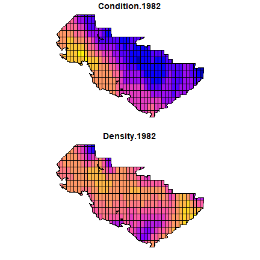
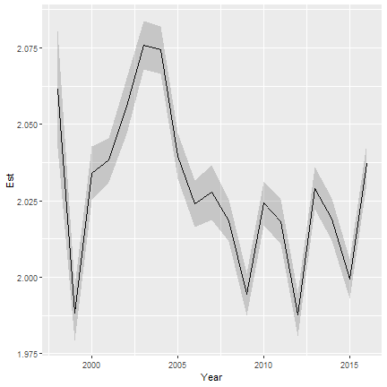

```r
library(tinyVAST)
library(fmesher)
library(sf)
library(ggplot2)
```

`tinyVAST` is an R package for fitting vector autoregressive spatio-temporal (VAST) models using a minimal and user-friendly interface.
We here show how it can fit a bivariate spatio-temporal model representing density dependence in physiological condition for fishes.  
This replicates a similar vignette provided for the VAST package, but showcases several improvements in interpretation and interface.

We first load and combine the two data sets:


```r
data( condition_and_density )

# Combine both parts
combo_data = plyr::rbind.fill( condition_and_density$condition, 
                              condition_and_density$density )

# Reformat data in expected format
formed_data = cbind( combo_data[,c("Year","Lat","Lon")],
  "Type" = factor(ifelse( is.na(combo_data[,'Individual_length_cm']), 
                   "Biomass", "Condition" )),
  "Response" = ifelse( is.na(combo_data[,'Individual_length_cm']), 
                        combo_data[,'Sample_biomass_KGperHectare'], 
                        log(combo_data[,'Individual_weight_Grams']) ),
  "log_length" = ifelse( is.na(combo_data[,'Individual_length_cm']), 
                        rep(0,nrow(combo_data)), 
                        log(combo_data[,'Individual_length_cm'] / 10) ))

#
#formed_data$Year_Type = paste0( formed_data$Year, "_", formed_data$Type )
```

We then construct the SPDE mesh

```r
# make mesh
mesh = fm_mesh_2d( formed_data[,c('Lon','Lat')], cutoff=1 )
```

Next, we specify spatial and spatio-temporal variance in both condition and density. 

```r
#
sem = "
  Biomass <-> Biomass, sdB
  Condition <-> Condition, sdC
  Biomass -> Condition, dens_dep
"

#
dsem = "
  Biomass <-> Biomass, 0, sdB
  Condition <-> Condition, 0, sdC
  Biomass -> Condition, 0, dens_dep
"
```

Finally, we define the distribution for each data set using the `family` argument:

```r
#
family = list(
  Biomass = tweedie(),
  Condition = gaussian()
)
```

Finally, we fit the model using tinyVAST

```r
# fit model
fit = tinyVAST( data = formed_data,
           formula = Response ~ interaction(Year,Type) + log_length,
           spatial_graph = mesh,
           control = tinyVASTcontrol( trace=1, verbose=TRUE, profile="alpha_j" ),
           sem = sem,
           dsem = dsem,
           family = family,
           variables = c("Biomass","Condition"),
           variable_column = "Type",
           space_columns = c("Lon", "Lat"),
           time_column = "Year",
           distribution_column = "Type",
           times = 1982:2016 )
#>   0:     61175.720:  1.00000  1.00000 0.0100000  1.00000  1.00000 0.0100000  0.00000  0.00000  0.00000  0.00000
#>   1:     49360.066:  1.03040 0.968858 0.0100282  1.00387 0.996882 0.00995039 0.626356 0.470414 -0.620054 0.00201580
#>   2:     39847.140:  1.02389 0.903125 0.0100658  1.00866 0.991282 0.00984710 0.642754 0.585272 -1.61103 -0.00713197
#>   3:     38511.321:  1.02156 0.879614 0.0101228  1.00996 0.989569 0.00979521 0.633929 0.604962 -1.80841 -0.0107436
#>   4:     37262.397:  1.01579 0.816408 0.0102898  1.01331 0.985087 0.00964459 0.612483 0.652849 -2.19969 -0.0202993
#>   5:     37032.127: 0.993686 0.517355 0.0111343  1.02776 0.965069 0.00883200 0.534380 0.829948 -2.02592 -0.0628501
#>   6:     36383.831: 0.970842 -0.255874 0.0131234  1.05476 0.924342 0.00756012 0.475844 0.978169 -2.11616 -0.138105
#>   7:     35938.024: 0.972968 -0.0746209 0.0124061  1.05833 0.918011 0.00746826 0.489644 0.967694 -2.21787 -0.143353
#>   8:     35878.715: 0.973235 -0.0465834 0.0119370  1.05890 0.916955 0.00745940 0.490560 0.966048 -2.20098 -0.142393
#>   9:     35865.648: 0.973790 -0.0300829 0.0111182  1.06011 0.914712 0.00743848 0.492371 0.962655 -2.17308 -0.140175
#>  10:     35862.533: 0.976143 -0.0513135 0.0178923  1.06838 0.899835 0.00721022 0.500161 0.950575 -2.16470 -0.143195
#>  11:     35853.083: 0.976455 -0.0419575 0.0106361  1.06953 0.897641 0.00718618 0.500972 0.948741 -2.16419 -0.142110
#>  12:     35852.303: 0.976571 -0.0386401 0.0111122  1.06992 0.896862 0.00717874 0.501037 0.947896 -2.16301 -0.141448
#>  13:     35851.811: 0.976790 -0.0402247 0.0113911  1.07066 0.895360 0.00716410 0.501183 0.946314 -2.16075 -0.140230
#>  14:     35851.250: 0.977339 -0.0367318 0.0101172  1.07271 0.891242 0.00712288 0.502109 0.943135 -2.15929 -0.137097
#>  15:     35849.999: 0.977851 -0.0398043 0.0109337  1.07495 0.886644 0.00707786 0.503370 0.940611 -2.15917 -0.133393
#>  16:     35848.641: 0.978574 -0.0372903 0.0131727  1.07975 0.876381 0.00698092 0.505274 0.936244 -2.15994 -0.125065
#>  17:     35846.755: 0.979112 -0.0388699 0.00900563  1.08458 0.865906 0.00687989 0.506643 0.931966 -2.15890 -0.117420
#>  18:     35845.493: 0.978752 -0.0395427 0.0145778  1.08920 0.854778 0.00677486 0.506193 0.929828 -2.15831 -0.110283
#>  19:     35843.669: 0.978507 -0.0373623 0.0109002  1.09396 0.843313 0.00666775 0.506376 0.927425 -2.15808 -0.102897
#>  20:     35842.395: 0.977596 -0.0418278 0.0118930  1.09834 0.831219 0.00655814 0.505758 0.926947 -2.15791 -0.0961845
#>  21:     35836.779: 0.974754 -0.0381592 0.0181979  1.12040 0.771691 0.00601437 0.505680 0.920341 -2.15672 -0.0622020
#>  22:     35827.696: 0.966302 -0.0390669 0.00919075  1.13630 0.706678 0.00548108 0.498988 0.929833 -2.15854 -0.0393872
#>  23:     35790.186: 0.958800 -0.0402943 0.0103187  1.16906 0.419139 0.00326795 0.507756 0.922387 -2.16159 -0.0127084
#>  24:     35727.951: 0.947964 -0.0413302 0.0128772  1.22970 -0.157444 -0.00101472 0.516722 0.917030 -2.16509 0.0351160
#>  25:     35723.671: 0.949063 -0.0374038 0.00607079  1.23027 -0.143740 -0.000631587 0.514159 0.916069 -2.16059 0.0357217
#>  26:     35719.972: 0.956277 -0.0437709 0.0108998  1.23670 -0.137419 -0.00112353 0.510005 0.919161 -2.15947 0.0430583
#>  27:     35716.696: 0.956547 -0.0369942 0.0103024  1.24368 -0.129594 -0.000862757 0.509040 0.919165 -2.16063 0.0540463
#>  28:     35712.647: 0.952375 -0.0428061 0.00963241  1.24988 -0.121373 -8.26871e-05 0.513156 0.912878 -2.16090 0.0620794
#>  29:     35706.504: 0.948124 -0.0371248 0.00898919  1.26765 -0.105246 -0.0102776 0.514482 0.908850 -2.16126 0.0812857
#>  30:     35706.145: 0.950891 -0.0381937 0.00961315  1.29220 -0.0851550 0.0425473 0.510807 0.910423 -2.16062 0.106733
#>  31:     35700.852: 0.951478 -0.0478105 0.0114090  1.29235 -0.0782136 0.0316891 0.510624 0.910526 -2.15972 0.106476
#>  32:     35693.099: 0.958539 -0.0381834 0.00987096  1.29699 -0.0719109 0.0257458 0.508130 0.913195 -2.16001 0.109339
#>  33:     35683.341: 0.968376 -0.0475593 0.00821087  1.31402 -0.0544208 0.0138222 0.503366 0.918280 -2.15808 0.117981
#>  34:     35674.677: 0.914754 -0.0380726 0.00687625  1.33410 -0.0336419 0.00441775 0.515666 0.905483 -2.15845 0.119901
#>  35:     35672.667: 0.975516 -0.0454030 0.00878586  1.35340 -0.0310045 -0.00126180 0.516221 0.902722 -2.16067 0.113971
#>  36:     35672.152: 0.975263 -0.0373352 0.00738979  1.35347 -0.0328698 -0.000632365 0.515494 0.902894 -2.16086 0.113904
#>  37:     35670.895: 0.972266 -0.0415423 0.00818504  1.35776 -0.0333333 -0.000597294 0.512338 0.906484 -2.15980 0.112600
#>  38:     35670.727: 0.969631 -0.0405592 0.00824559  1.36367 -0.0333535 -0.000467365 0.509327 0.910073 -2.15913 0.110102
#>  39:     35670.672: 0.968465 -0.0412712 0.00786776  1.36869 -0.0333383 3.13835e-05 0.509863 0.909401 -2.15910 0.103510
#>  40:     35670.613: 0.968180 -0.0403225 0.00815403  1.37446 -0.0333741 7.76127e-06 0.510575 0.908652 -2.15917 0.0975017
#>  41:     35670.564: 0.970021 -0.0408550 0.00841012  1.38217 -0.0332890 -0.000154105 0.509351 0.910394 -2.15931 0.0955292
#>  42:     35670.523: 0.966646 -0.0405380 0.00795700  1.38917 -0.0332562 -0.000168163 0.509783 0.910136 -2.15933 0.0922726
#>  43:     35670.501: 0.968343 -0.0405946 0.00843631  1.39719 -0.0329208 0.000251718 0.508936 0.911371 -2.15939 0.0909932
#>  44:     35670.492: 0.967941 -0.0407740 0.00812180  1.39985 -0.0336753 -4.71867e-05 0.509010 0.911280 -2.15939 0.0884405
#>  45:     35670.486: 0.968551 -0.0402129 0.00819610  1.40322 -0.0332306 -0.000260685 0.508290 0.912076 -2.15926 0.0873913
#>  46:     35670.476: 0.966381 -0.0407966 0.00848947  1.40598 -0.0330273 -9.65111e-05 0.508815 0.911613 -2.15935 0.0862966
#>  47:     35670.468: 0.967260 -0.0405082 0.00797273  1.40737 -0.0330722 0.000126346 0.508957 0.911414 -2.15947 0.0857704
#>  48:     35670.465: 0.966720 -0.0404859 0.00832870  1.40901 -0.0333672 4.59939e-05 0.508815 0.911806 -2.15958 0.0859503
#>  49:     35670.462: 0.966712 -0.0406500 0.00819794  1.40902 -0.0332623 6.95928e-05 0.508769 0.911826 -2.15956 0.0859321
#>  50:     35670.462: 0.966705 -0.0405609 0.00819106  1.40903 -0.0332153 7.21032e-05 0.508734 0.911844 -2.15956 0.0859190
#>  51:     35670.462: 0.966694 -0.0406339 0.00818688  1.40905 -0.0331846 7.20136e-05 0.508674 0.911877 -2.15955 0.0858928
#>  52:     35670.461: 0.966747 -0.0405622 0.00818708  1.40916 -0.0331811 6.94664e-05 0.508649 0.911897 -2.15953 0.0857337
#>  53:     35670.460: 0.966864 -0.0406152 0.00819276  1.40944 -0.0331819 6.85353e-05 0.508627 0.911927 -2.15949 0.0854230
#>  54:     35670.460: 0.966987 -0.0405409 0.00819074  1.41025 -0.0331718 6.45736e-05 0.508652 0.911956 -2.15948 0.0851151
#>  55:     35670.458: 0.966653 -0.0406082 0.00815091  1.41188 -0.0331683 3.64762e-05 0.508546 0.912087 -2.15959 0.0856498
#>  56:     35670.457: 0.966682 -0.0405685 0.00828154  1.41328 -0.0331598 0.000121073 0.508543 0.912001 -2.15945 0.0846007
#>  57:     35670.456: 0.966829 -0.0405567 0.00809688  1.41330 -0.0332618 5.14548e-05 0.508407 0.912660 -2.15923 0.0830126
#>  58:     35670.454: 0.967371 -0.0405191 0.00822226  1.41460 -0.0331531 7.62722e-05 0.508406 0.912426 -2.15955 0.0820429
#>  59:     35670.453: 0.966722 -0.0406361 0.00815649  1.41614 -0.0331236 0.000108483 0.508386 0.912323 -2.15948 0.0825489
#>  60:     35670.453: 0.966190 -0.0404680 0.00819768  1.41721 -0.0331392 6.84657e-05 0.508175 0.912603 -2.15945 0.0837755
#>  61:     35670.452: 0.966370 -0.0405910 0.00818336  1.41805 -0.0331819 6.94190e-05 0.508203 0.912690 -2.15948 0.0839281
#>  62:     35670.452: 0.966492 -0.0405482 0.00816224  1.41878 -0.0331862 8.63853e-05 0.508322 0.912561 -2.15953 0.0834961
#>  63:     35670.451: 0.966538 -0.0405634 0.00822335  1.41886 -0.0331417 -4.67738e-06 0.508243 0.912431 -2.15951 0.0826434
#>  64:     35670.451: 0.966461 -0.0405659 0.00824935  1.41939 -0.0331497 0.000116137 0.508181 0.913061 -2.15952 0.0823709
#>  65:     35670.451: 0.966459 -0.0405442 0.00819692  1.41939 -0.0331663 0.000105139 0.508170 0.913055 -2.15952 0.0823674
#>  66:     35670.451: 0.966458 -0.0405607 0.00819701  1.41940 -0.0331682 9.54541e-05 0.508157 0.913047 -2.15952 0.0823626
#>  67:     35670.451: 0.966457 -0.0405439 0.00819613  1.41941 -0.0331675 9.20825e-05 0.508145 0.913039 -2.15952 0.0823593
#>  68:     35670.450: 0.966460 -0.0405582 0.00819667  1.41945 -0.0331685 9.27797e-05 0.508132 0.913031 -2.15952 0.0823596
#>  69:     35670.450: 0.966464 -0.0405454 0.00819584  1.41955 -0.0331682 9.41337e-05 0.508119 0.913019 -2.15952 0.0823656
#>  70:     35670.450: 0.966457 -0.0405594 0.00818641  1.42103 -0.0331627 0.000113730 0.508161 0.912929 -2.15949 0.0825483
#>  71:     35670.450: 0.966442 -0.0405551 0.00820005  1.42148 -0.0331894 0.000128008 0.508029 0.913011 -2.15952 0.0821639
#>  72:     35670.450: 0.966442 -0.0405345 0.00820117  1.42148 -0.0331560 8.67726e-05 0.508038 0.913007 -2.15952 0.0821575
#>  73:     35670.450: 0.966428 -0.0405570 0.00819661  1.42152 -0.0331631 8.76175e-05 0.508044 0.913008 -2.15952 0.0821224
#>  74:     35670.450: 0.966412 -0.0405476 0.00819633  1.42156 -0.0331646 8.81999e-05 0.508050 0.913008 -2.15952 0.0820810
#>  75:     35670.450: 0.966342 -0.0405550 0.00819837  1.42186 -0.0331686 8.34091e-05 0.508076 0.913026 -2.15952 0.0818585
#>  76:     35670.450: 0.966449 -0.0405460 0.00820281  1.42223 -0.0331762 7.88997e-05 0.508073 0.913050 -2.15952 0.0818638
#>  77:     35670.450: 0.966492 -0.0405336 0.00818780  1.42217 -0.0331420 0.000122209 0.508093 0.912931 -2.15951 0.0815095
#>  78:     35670.450: 0.966485 -0.0405576 0.00820375  1.42236 -0.0331608 0.000101648 0.508087 0.912931 -2.15951 0.0815080
#>  79:     35670.450: 0.966460 -0.0405407 0.00820080  1.42255 -0.0331607 9.65838e-05 0.508078 0.912948 -2.15951 0.0815278
#>  80:     35670.450: 0.966433 -0.0405451 0.00819821  1.42305 -0.0331545 9.59201e-05 0.508059 0.912988 -2.15952 0.0815655
#>  81:     35670.450: 0.966436 -0.0405429 0.00820114  1.42354 -0.0331618 9.74719e-05 0.508083 0.912932 -2.15951 0.0814779
#>  82:     35670.450: 0.966453 -0.0405422 0.00819746  1.42370 -0.0331624 9.50096e-05 0.508086 0.912943 -2.15951 0.0813961
#>  83:     35670.450: 0.966426 -0.0405420 0.00820206  1.42388 -0.0331629 9.28432e-05 0.508086 0.912933 -2.15951 0.0813760
```

We can look at structural parameters using summary functions:

```r
# spatial terms
summary(fit, "sem")
#>   heads        to      from parameter start      Estimate   Std_Error    z_value      p_value
#> 1     2   Biomass   Biomass         1  <NA>  1.423877e+00 0.133046766 10.7020787 9.952027e-27
#> 2     2 Condition Condition         2  <NA> -3.316292e-02 0.004167604 -7.9573093 1.758208e-15
#> 3     1 Condition   Biomass         3  <NA>  9.284318e-05 0.004855103  0.0191228 9.847431e-01

# spatio-temporal terms
summary(fit, "dsem")
#>   heads        to      from parameter start lag     Estimate   Std_Error    z_value      p_value
#> 1     2   Biomass   Biomass         1  <NA>   0  0.966426021 0.024274815  39.811879 0.000000e+00
#> 2     2 Condition Condition         2  <NA>   0 -0.040542030 0.002723405 -14.886521 4.032119e-50
#> 3     1 Condition   Biomass         3  <NA>   0  0.008202062 0.003339318   2.456209 1.404115e-02
```

# Abundance-weighted expansion

To explore output, we can plot output using the survey extent:


```r
# Extract shapefile
region = condition_and_density$eastern_bering_sea

# make extrapolation-grid
sf_grid = st_make_grid( region, cellsize=c(0.5,0.5) )
sf_grid = st_intersection( sf_grid, region )
sf_grid = st_make_valid( sf_grid )

#
grid_coords = st_coordinates( st_centroid(sf_grid) )
areas_km2 = st_area( sf_grid ) / 1e6

# Condition in 
newdata = data.frame( "Lat" = grid_coords[,'Y'], 
                      "Lon" = grid_coords[,'X'],
                      "Year" = 1982,
                      "Type" = "Condition",
                      #"Year_Type" = "1982_Condition",
                      "log_length" = 0 )
cond_1982 = predict(fit, newdata=newdata, what="p_g")

# Repeat for density
newdata2 = newdata
newdata2$Type = "Biomass"
#newdata2$Year_Type = "1982_Biomass"
dens_1982 = predict(fit, newdata=newdata2, what="p_g")

# Plot on map
plot_grid = st_sf( sf_grid, 
                    "Condition.1982" = cond_1982,
                    "Density.1982" = dens_1982 )

plot( plot_grid )
```



# Density-weighted condition

Finally, we can calculate density-weighted condition


```r
# 
expand_data = rbind( newdata2, newdata )
W_gz = cbind( c(as.numeric(areas_km2),rep(0,length(areas_km2))), 0 )
V_gz = cbind( rep(c(0,3),each=length(areas_km2)), seq_along(areas_km2)-1 )

#
cond_tz = data.frame( "Year"=1998:2016, "Est"=NA, "SE"=NA )
for( yearI in seq_len(nrow(cond_tz)) ){
  expand_data[,'Year'] = cond_tz[yearI,"Year"]
  out = integrate_output( fit, 
                          newdata = expand_data,
                          V_gz = V_gz,
                          W_gz = W_gz, 
                          bias.correct = TRUE ) 
  cond_tz[yearI,c("Est","SE")] = out[c("Estimate","Std. Error")]
}

# plot time-series
ggplot( cond_tz ) +
  geom_line( aes(x=Year, y=Est) ) +
  geom_ribbon( aes(x=Year, ymin=Est-SE, ymax=Est+SE), alpha=0.2 )
```


