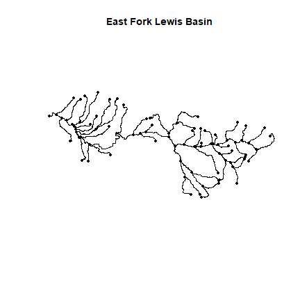
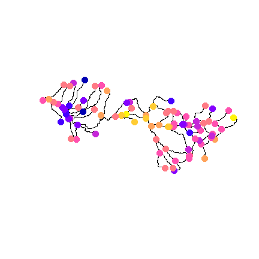
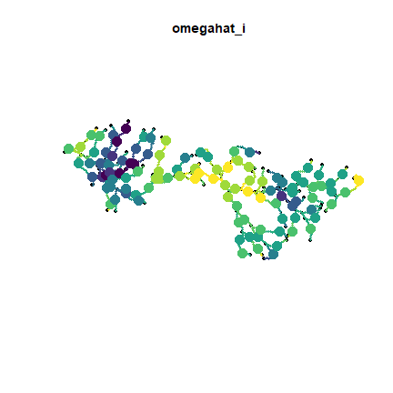

```r
library(sf)
library(sfnetworks)
library(tinyVAST)
library(viridisLite)
set.seed(101)
options("tinyVAST.verbose" = FALSE)
```

`tinyVAST` is an R package for fitting vector autoregressive spatio-temporal (VAST) models using a minimal and user-friendly interface.
We here show how it can fit a stream network model, where spatial correlations arise from stream distances along a network.

First, we load a shapefile representing a stream network, and convert it to _sfnetwork_ format.  This format includes
edges representing stream segments, and nodes where edges connect.

```r
stream <- st_read( file.path(system.file("stream_network",package="tinyVAST"),
                   "East_Fork_Lewis_basin.shp"), quiet=TRUE )
stream = as_sfnetwork(stream)
plot(stream, main="East Fork Lewis Basin")
```



We then convert it to an S3 class "sfnetwork_mesh" defined by _tinyVAST_ for stream networks,
and rescale distances to 1000 ft (to ensure that distances are 0.01 to 100, avoiding
issues of numerical under or overflow).

```r
# Rescale
graph = sfnetwork_mesh( stream )
graph$table$dist = graph$table$dist / 1000  # Convert distance scale
```

Next, we'll simulate a Gaussian Markov random field at stream vertices using `simulate_sfnetwork`,
sample evenly spaced locations along the stream using `st_line_sample`,
project the GMRF to those locations using `sfnetwork_evaluator`, and
simulate data at those locations:

```r
# Parameters
alpha = 2
kappa = 0.05
# mean(graph$table$dist) * kappa = 0.63 -> exp(-0.63) = 0.5 average correlation

# simulate
omega_s = simulate_sfnetwork( n=1, sfnetwork_mesh=graph, theta=kappa)[,1]

# sample locations along network
extrap = st_union( st_line_sample( activate(stream,"edges"), density=1/10000))
extrap = st_cast( extrap, "POINT" )

# Project to sampled locations
A_is = sfnetwork_evaluator( stream = graph$stream,
                                loc = st_coordinates(extrap) )
omega_i = (A_is %*% omega_s)[,1]

# Simulate sampling
#Count = rpois( n=graph$n, lambda=exp(alpha + omega) )
Count_i = rnorm( n=length(omega_i), mean=alpha + omega_i, sd=0.5 )

# Format into long-form data frame expected by tinyVAST
Data = data.frame( Count = Count_i,
                   st_coordinates(extrap),
                   var = "species",  # Univariate model so only one value
                   time = "2020",    # no time-dynamics, so only one value
                   dist = "obs" )    # only one type of sampling in data
```

We can visualize the GMRF at those locations using _sfnetwork_

```r
# Plot stream
plot(stream)
# Extract nodes and plot on network
plot( st_sf(st_geometry(activate(stream,"nodes")), "omega"=omega_s),
      add=TRUE, pch=19, cex=2)
```



Finally, we can fit the model, interpolate the GMRF along at dense locations along
the stream network, and plot those with the true (simulated) values at the
location of simulated samples.

```r
# fit model
out = tinyVAST( data = Data,
           formula = Count ~ 1,
           spatial_graph = graph,
           space_column = c("X","Y"),
           variable_column = "var",
           time_column = "time",
           distribution_column = "dist",
           sem = "" )

#
sf_plot = st_union( st_line_sample( activate(stream,"edges"), density=1/1000))
sf_plot = st_cast( sf_plot, "POINT" )
newdata = data.frame( Count = NA,
                   st_coordinates(sf_plot),
                   var = "species",  # Univariate model so only one value
                   time = "2020",    # no time-dynamics, so only one value
                   dist = "obs" )    # only one type of sampling in data
omega_plot = predict( out, newdata = newdata )

# Plot estimated GMRF at sampled locations
plot( stream, main="omegahat_i")
plot( st_sf(sf_plot,"omega"=omega_plot), add=TRUE, pch=19, cex=0.5, pal=viridis )
plot( st_sf(extrap,"omega"=omega_i), add=TRUE, pch=19, cex=2, pal=viridis )
```


